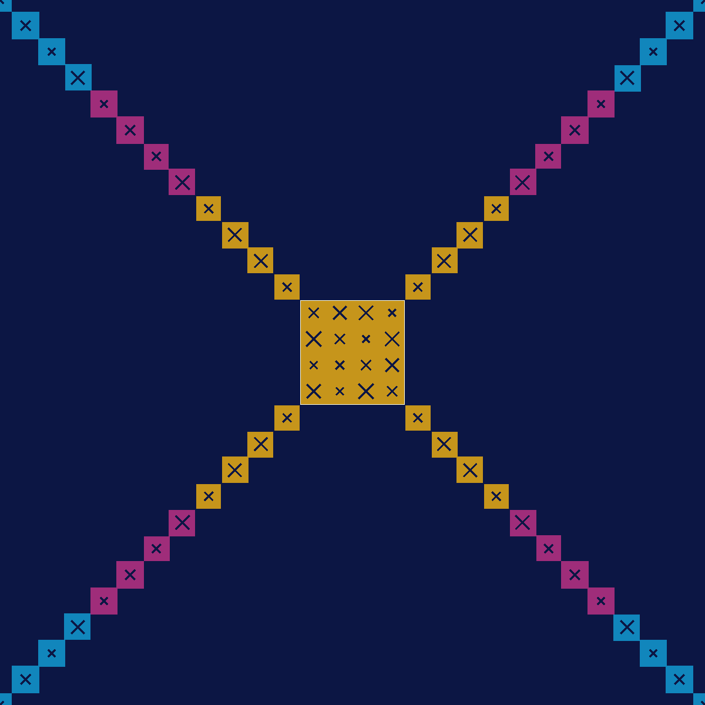

# MakerX Acoustic Diffuser Tile — Opus 5.0 v2

A 250 × 250 mm wall tile that **scatters** mid/high-frequency reflections instead of
bouncing them straight back, with a set of tuned cavities that **absorb** a band of the
low-mids. Branded in MakerX colours, with the MakerX X doing structural work rather than
sitting on top as decoration.

Built from four identical 125 × 125 mm printed quadrants. Tiles butt edge-to-edge to
cover as much wall as you like.

Two series live here, both maintained:

- **125 series** — 125mm joinable quadrants, 4 to a 250mm tile. Prints fail cheap (~8h).
  Colour by elevation band, ~zero purge. Start here.
- **500 series** — one 250mm tile with a corner notch; 4 tiles + a key make 500×500 with a
  single giant X. Bigger statement, ~30h prints. See [The 500 series](#the-500-series).

## Files

**Print v2.** It is the same tile acoustically but uses **35% less plastic** — see
[Why v2 is lighter](#why-v2-is-lighter).

| File | What it is |
|---|---|
| `makerx-diffuser-tile-v2.scad` | **Current source.** Shared walls, 2 perimeters, thinner back plate. |
| `makerx-diffuser-quadrant-v2-4colour.3mf` | **Best starting point.** Bambu project with print settings baked in *and* the four colour bands already split into filament-assigned parts. Open, pick 4 filaments, slice. |
| `makerx-diffuser-quadrant-v2-logo.stl` | v2 geometry as a single mesh, X-forming height map. |
| `makerx-diffuser-quadrant-v2-qrd.stl` | v2, textbook quadratic-residue height map — acoustically optimal, but the peaks form a ring, not an X. |
| `make-multicolour-3mf.py` | Turns a single-colour project 3MF into a multi-filament one. Python stdlib only. |
| `makerx-diffuser-tile-v1.scad` + `makerx-diffuser-quadrant-logo.*` | The original, kept for comparison. Heavier; identical acoustics. |
| `render-*.png` | Face, isometric, tile, and section views, rendered from v2. |

`part=` values: `quadrant` (the print), `band` (with `band=1..4`, one colour band),
`tile`, `quad_colour`, `tile_colour`, `cutaway`, `logo`, `interference`.

## How it works

Two mechanisms, deliberately tuned to hand over to each other with no gap between them.

**Diffusion — 2.27 kHz to 9.6 kHz.** A 7 × 7 grid of blocks at seven discrete heights
(0 – 64.8 mm in 10.8 mm steps) forms a phase grating: reflections off different cells come
back out of step and cancel the specular lobe, spreading the energy instead. The step size
sets the design frequency (2269 Hz); the 17.86 mm cell pitch sets the upper limit
(9604 Hz), above which a cell is no longer small compared to a wavelength.

**Absorption — roughly 690 Hz to 2 kHz.** 48 of the 49 blocks are hollow and sealed, so
each is a Helmholtz resonator: the cavity is the volume, the X-shaped slot in its cap is
the neck. Six tunings, laddered by cell height and slot size:

| Cell height | Cavity | X slot | Tuned to |
|---|---|---|---|
| 10.8 mm | 1 990 mm³ | 7.0 mm | 1999 Hz |
| 21.6 mm | 4 570 mm³ | 12.0 mm | 1595 Hz |
| 32.4 mm | 7 150 mm³ | 13.0 mm | 1310 Hz |
| 43.2 mm | 9 731 mm³ | 10.5 mm | 1044 Hz |
| 54.0 mm | 12 311 mm³ | 8.0 mm | 844 Hz |
| 64.8 mm | 14 891 mm³ | 6.0 mm | 690 Hz |

**The X is the neck, not a logo stuck on a neck.** A bare Helmholtz resonator is nearly
undamped: a needle-sharp peak that absorbs almost nothing either side of it. Damping comes
from viscous loss against the walls of the opening, which scales with wetted perimeter for
a given open area. The X has **2.26× the perimeter of a round hole of equal area**, so
about 5× the resistance. That is what turns each resonator into something with usable
bandwidth — and it means the brand mark is load-bearing. There are 128 of them per tile.

### What this will not do

Worth being straight about, because acoustic products are routinely oversold:

- **It is not a bass trap and not broadband absorption.** Below ~600 Hz a 68 mm rigid
  panel behaves basically like the wall behind it. Physics: you cannot absorb a 100 Hz
  wave with 68 mm of anything rigid.
- **"Total internal reflection" doesn't apply to sound** at these scales — it's an optics
  idea. A rigid panel converts sound to heat only through resonance plus viscous/thermal
  loss in narrow openings, which is exactly what the Helmholtz cells do, and only over the
  band they're tuned for.
- **The tuning is a model, not a measurement.** The Helmholtz numbers carry the usual
  end-correction uncertainty, call it ±10%. They'll be in the right place; they won't be
  exact.
- **Mounting on 15–25 mm battens instead of flat** will do more for the low end than any
  feature printed into the panel. If you have the depth, use it.

## Why v2 is lighter

The v1 tile was ~255 g per quadrant. Almost none of that mass was doing anything.

**It wasn't structural** — the tile hangs on a wall and carries only its own weight.
**And it wasn't acoustic.** A Helmholtz resonator absorbs using the *enclosed air* and the
*slot*; the plastic is only an airtight, non-flexing container. The one real requirement is
that the surface reflects rather than flexes, which the mass law settles:

| Wall | Surface density | Reflected @ 1 kHz |
|---|---|---|
| 1.2 mm (v1) | 1.49 kg/m² | ~98% |
| **0.8 mm (v2)** | 0.99 kg/m² | ~95% |
| 0.45 mm | 0.56 kg/m² | ~84% — too floppy, and panel resonance lands in-band |

A 3 dB difference in reflected energy at the extreme, against a 35% material saving.

Where the v1 mass actually went, measured: back plate 21%, block shells 66%, caps 10%. So
the shells were the target, and the biggest single waste was that **v1 gave every cell its
own four walls** — every internal boundary carried two 1.2 mm walls stacked back to back.

v2 changes three things:

1. **Shared walls** — one wall on each boundary instead of two. Each block's prism is
   expanded to the boundary centre-line and each cavity inset from it.
2. **wall_t 1.2 → 0.8** (3 perimeters → 2, still airtight).
3. **base_t 3.0 → 2.4** — still solid right through at 5+5 solid layers.

**Result: 218.5 → 140.9 cm³ solid, ~255 g → ~168 g per quadrant (~1.02 kg → ~673 g per
tile).** The cavities got ~22% *bigger* as a side effect — the doubled walls became air —
so every X slot was reopened to hold the original tuning. Resonators land at 668–1909 Hz
against v1's 690–1999 Hz; diffusion is untouched.

Further levers if you want to go lower: `cap_t` 2.0 → 1.4 (~8 cm³, needs the slots
re-solved), or reduce `depth_step`, which trades directly against the low-frequency limit.

## Print

Settings are already baked into the `.3mf`. If you're using the STL instead:

- **PLA**, 0.2 mm layers, **2 walls**, 15% gyroid, **5 top and 5 bottom solid layers**
  (this one matters — the cavities must be gas-tight or the tuning is gone), **no supports**.
- Orientation **as modelled**: back plate flat on the bed, blocks up. Don't rotate it —
  any other orientation needs support inside all 48 cavities.
- PLA over PETG on purpose: PETG strings, and a string across a 1.2 mm X slot changes the
  neck area and detunes the resonator. PLA also bridges the 11.5 mm cavity caps cleanly.
- One quadrant per plate (133 × 133 mm footprint including the joining pins).

**Rough cost per quadrant (v2): ~168 g of PLA and ~7–9 hours** — about **673 g and roughly
a day per finished 250 mm tile**. These are computed from the measured 140.9 cm³ solid
volume plus an infill allowance, not sliced; confirm in Bambu Studio before committing to a
wall of them.

### The four colours

Colour is applied as **elevation bands**, so the whole print needs only **three filament
changes** — not per-cell painting, which would need ~4 AMS tool changes on every one of
336 layers and burn about 2.7 kg in purge per tile.

**The supplied `-4colour.3mf` already carries this**: the quadrant arrives as one object
split into four filament-assigned parts, so Bambu Studio inserts the tool changes itself.
Just assign 4 filaments and slice. To do it by hand from the STL instead, insert a filament
change at **Z = 34.8 / 45.6 / 56.4 mm** (layers **175 / 229 / 283** at 0.2 mm), bottom to
top:

| Band | Colour | MakerX token |
|---|---|---|
| 0 → 35.4 mm | `#0f1c57` navy | `--color-mx-blue` |
| 35.4 → 46.2 | `#16acf2` electric blue | `--color-mx-electic-blue` |
| 46.2 → 57.0 | `#cc3a9d` magenta | `--color-mx-magenta` |
| 57.0 → 67.8 | `#ffc023` gold | `--color-mx-gold` |

Blue → magenta → gold is the gradient from the makerx.com.au hero, in order. Because
colour tracks height and the tallest cells lie on the diagonals, this paints a **gold X
with magenta tips on a navy field** — the branding costs the acoustics nothing, because it
rides entirely on a property (colour) that sound cannot detect.

All colours and the logomark were taken from the live site's CSS custom properties and
logo SVG, not eyeballed.

## The 500 series

An alternate, not a replacement. One printed part is a full **250 × 250 mm** tile with a
square notch bitten out of a corner. Four of them, each rotated 90° further so the notches
meet in the middle, tile into **500 × 500 mm**; the notches combine into a 71.43 mm hole
filled by a separately printed **key**. Each tile's main diagonal is one arm of a single
500 mm X, and the key is its crossing.

| File | What it is |
|---|---|
| `makerx-diffuser-tile-500-v1.scad` | Source for the whole series. |
| `makerx-500-tile-v1-4colour.3mf` | **Start here.** Settings baked in, four filament-assigned parts. |
| `makerx-500-key-v1-2colour.3mf` | The centre key, navy body + gold crossing. |
| `makerx-500-*-v1.stl` | Tile, key and spline as single meshes. |

**Why the notch.** The X1/P1 reserves an 18 × 28 mm front-left corner of the bed. The usual
escape is Bambu's stopper-clip mod, but that disables the filament cutter and so the AMS —
it would forbid the multi-colour this design is built around. Notching the part instead
keeps the exclusion zone *and* the AMS. Verified: the 2×2-cell (35.71 mm) notch clears the
zone at 0, 3 and 6 mm bed margin.

Be clear what the notch is worth: simply shifting a plain tile right to dodge the zone
already allows ~235 mm at the same margin. The notch buys 250 mm — **+12.8% area**. Its
real value is that 250 is the module where four tiles land on exactly 500 × 500 and the
notches self-assemble into a home for the key.

**Colour works differently here.** The 125 series paints colour in elevation bands, which
means colour *is* height — so drawing an X forces the X cells to be tallest and biases the
relief. The 500 series instead colours only the **top 0.6 mm** of each cell, chosen per
cell. Because cell tops sit at just 7 discrete heights, the cost stays small. Measured:

| Scheme | Tool changes | Purge/tile | Height field |
|---|---|---|---|
| Elevation bands (125 series) | 3 | ~2 g | X must be the tallest cells |
| Naive full-height per-cell | 909 | ~676 g | free |
| **Top skin (500 series)** | **40** | **~20–30 g** | **free — well mixed** |

That ~25 g buys a genuinely well-mixed relief, so the branding costs the diffusion nothing.
The height field is four 7×7 QRD blocks at four different rotations, which breaks the
7-cell periodicity while keeping the histogram: measured `[3,30,31,32,32,32,32]` over 192
cells.

**Honest visual trade.** The X reads strongly face-on and weakly at an oblique angle — the
colour is a thin skin, and tall navy blocks screen the lower coloured cells. That is the
price of not sculpting the X into the relief. If you want it bolder, `colour_mode =
"elevation"` puts the X on the tallest cells for ~zero purge, at the cost of a diagonal
ridge in the height field.

**Print warnings, both real:**

- A 250 mm part leaves **~3 mm of bed margin — no brim is possible**, and PLA corner lift is
  documented on 150 mm+ parts. `base_t` is 3.0 mm here, not v2's 2.4 mm, because the back
  plate is what resists warping and the v2 thinning does not scale.
- **`make-bambu-3mf.py` will warn that the footprint covers the exclusion zone.** That is a
  false positive for this design: the tool tests the bounding box and cannot see the notch.
  Placement is centred (3 mm margin), which the geometry check confirms is clear.
- Nothing protrudes past 250 mm — the 125 series' joining pins would make the footprint
  258 mm and would not fit the bed. Tiles align via a pocket at the middle of each edge and
  a loose printed **spline** that bridges two facing pockets. The midpoint is its own
  mirror, so that joint is rotation-agnostic for free.

Acoustics are unchanged from the 125 series by construction — same 17.857 mm pitch and
10.8 mm depth step, so f₀ 2269 Hz, upper limit 9604 Hz and resonators 668–1909 Hz all carry
over verbatim.

**Verified:** every `part=` compiles clean; 0 non-manifold edges throughout; the colour
split is an exact partition (body 561.08 + skins 0.77 + 0.78 + 0.77 = 563.40 cm³, and key
50.36 + 2.96 = 53.32 cm³); the assembly volume equals 4 × tile + key exactly
(2306.92 cm³), so no tile or key shares any volume; and both 3MFs round-trip through
lib3mf to their source volumes.

## Assembly and mounting

Four quadrants make a tile. **Rotate each one a further 90°** (0/90/180/270) as you lay
them out — the height map is deliberately not 4-fold symmetric, so rotating breaks the
125 mm periodicity that would otherwise put grating lobes in the scattering pattern. The X
is 4-fold symmetric, so the branding looks identical whichever way each quadrant goes.

Edges self-align: every edge carries a pin at 25% and a socket at 75% of its length,
walked counter-clockwise. Two edges that meet are traversed in opposite directions, so pin
always lands on socket — for any rotation and any tiling. This was checked by
intersecting neighbouring quadrants in all 8 direction × rotation combinations; every one
returns zero shared volume.

Mount with double-sided foam tape or Command strips on the flat back, or on 15–25 mm
battens for a rear air gap (better low end). No screw holes on purpose — a hole through
the back plate would vent the resonator sitting above it.

## Tweaking

| Want | Change |
|---|---|
| Lower diffusion band | `depth_step` (keep a whole number of layers; deeper = lower = heavier) |
| Retune the absorbers | `NECK_SPAN` per height class, or `depth_step` |
| Lighter / faster | `wall_t` 1.2 → 0.8 |
| Optimal scattering, no X | `height_map = "qrd"` |
| Different colour split | `band_top_s` (cosmetic only — `[2,3,4]` puts 16 cells in gold and the X disappears) |
| Different tile size | `tile_size` (printed footprint = `tile_size + 2*tab_out`) |

The model asserts its own contracts — slot printability, slot fit inside the cap, bridge
span within PLA's limit, layer-multiple dimensions, gas-tight floor above the joining
sockets, footprint inside the bed's AMS-usable area. Break one and the build fails with a
message rather than producing a quietly wrong part.

## Verified

OpenSCAD 2026.07.26 (Manifold backend). Every `part=` value compiles clean with no
warnings; measured bounding box 133 × 133 × **67.2** mm; 0 non-manifold edges on every
exported mesh (the check Bambu Studio would otherwise fail on); all asserts pass;
neighbour interference zero volume in all 8 direction × rotation configurations. Solid
volume **140.85 cm³**.

Two extra checks specific to v2:

- **The four colour bands sum to the whole part** — 99.29 + 17.53 + 14.27 + 9.76 =
  140.85 cm³, so the split loses and duplicates nothing.
- **The 4-colour 3MF round-trips through lib3mf** back to 140.85 cm³ at
  133 × 133 × 67.2 mm, confirming the container is valid and the geometry survived.
  (It has not been opened in Bambu Studio from here — worth a look before a long print.)

Not verified, and only a print will tell you: whether the cavities come out genuinely
airtight, how the X slots print at 1.2 mm, and what the panel actually measures in a room.

## Note

PLA is combustible and this is a plastic wall covering. For a handful of tiles in a home
or studio that's a non-issue; before covering a large wall in a commercial premises,
check it against local fire regulations.
