# MakerX Acoustic Tile — Opus 5.0

A 250 × 250 × 52 mm parametric acoustic **diffuser** tile in MakerX brand colours,
designed for FDM printing on a Bambu Lab X1C. It scatters mid/high-frequency
reflections rather than deadening them, and converts the dead space behind its
well floors into an array of tuned resonators that absorb a slice of the low-mids.

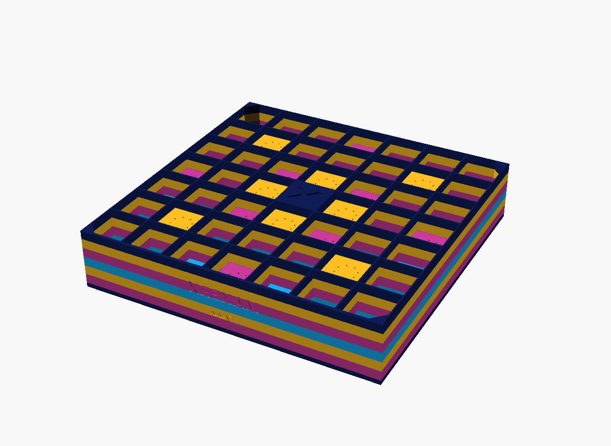

---

## Contents

| File | What it is |
|---|---|
| `makerx-acoustic-tile.scad` | **v1** — the 250 mm single tile. Needs the stopper-clip mod; manual colour swaps. |
| `makerx-acoustic-tile-v2.scad` | **v2** — a 190 mm module + printed bowtie key. Stock printer, AMS, per-cell colour. |
| `scripts/acoustic_model.py` | First-principles acoustic prediction (diffusion + absorption) and all the plots below. |
| `3mf/*.3mf` | **Bambu Studio project files** — open with print settings already applied. |
| `docs/*.png` | Renders and predicted-performance figures. |

Quick start:

```sh
# Look at it
openscad makerx-acoustic-tile.scad

# Export the printable tile
openscad --backend=Manifold -o tile.stl -D 'part="tile"' makerx-acoustic-tile.scad

# Print this first — 73 mm test coupon, ~1 h, validates bridging and neck holes
openscad --backend=Manifold -o coupon.stl -D 'part="coupon"' makerx-acoustic-tile.scad

# Re-run the acoustic model (tables + figures)
python3 scripts/acoustic_model.py            # add --sweep for the neck design study
```

---

## Bambu Studio 3MF files

`3mf/` holds Bambu **project** files, not bare geometry. They open in Bambu
Studio with layer height, walls, infill, supports and brim **already applied** —
no dialling settings in by hand. Built with the repo's
`.claude/skills/3d-print-designer/make-bambu-3mf.py` against Bambu's official
X1C profiles.

| File | What | Size | Mass |
|---|---|---|---|
| `makerx-acoustic-tile-v2-module.3mf` | v2 module — **start here** | 190 × 190 × 52 mm | 451 g |
| `makerx-acoustic-tile-v2-coupon.3mf` | v2 test coupon, ~40 min | 55.25 mm sq | 52 g |
| `makerx-acoustic-tile-v2-keys.3mf` | 12 bowtie keys | 148 × 68 × 4 mm | 34 g |
| `makerx-acoustic-tile-v1-250mm.3mf` | v1 tile — **needs the stopper-clip mod** | 250 × 250 × 52 mm | 699 g |
| `makerx-acoustic-tile-v1-coupon.3mf` | v1 test coupon, ~1 h | 73.04 mm sq | 82 g |

Baked-in settings, identical across all five:

```
printer   Bambu Lab X1 Carbon 0.4 nozzle      layer height  0.2 mm
process   0.20mm Standard @BBL X1C            walls         3   (overridden)
filament  printer default (change freely)     infill        15% gyroid (overridden)
                                              supports      off
                                              brim          outer_only (overridden)
```

Only `wall_loops`, `sparse_infill_pattern` and `brim_type` are flagged as
modified — layer height, infill density and supports already match the
`0.20mm Standard @BBL X1C` preset, so the tool correctly leaves them bound to
the system profile rather than marking them changed.

Filament is deliberately **not pinned**: the file uses your printer's default so
you can pick whatever PLA you have.

### Two caveats worth reading

**1. `v1-250mm.3mf` has the bed exclusion cleared.** A 250 mm footprint overlaps
the X1/P1 front-left filament-cutter corner, so this file additionally sets
`"bed_exclude_area": []`, flagged in the **printer** slot of
`different_settings_to_system` (the process slot would not bind). That only
matches reality **if you have fitted Bambu's stopper-clip mod** — and the clip
disables the cutter, so this file is **single-filament only, no AMS**. If you have
not fitted the clip, use the v2 module instead. The v2 files need no such patch:
a 190 mm part clears the exclusion when centred.

**2. These are single-body files.** The generator takes one mesh, so each 3MF is
one colour. For v2's four-colour `logo_x` scheme you still need the per-colour
bodies loaded as a multi-part object:

```sh
for c in navy magenta gold cyan; do
  openscad --backend=Manifold -o "v2-$c.stl" -D "part=\"$c\"" makerx-acoustic-tile-v2.scad
done
```

Load those four into Bambu Studio as one object and assign a filament to each.
Or open `v2-module.3mf`, print it in a single colour, and skip the AMS entirely.

### Regenerating them

```sh
python3 ../../.claude/skills/3d-print-designer/make-bambu-3mf.py \
  --scad makerx-acoustic-tile-v2.scad --openscad "<openscad>" \
  --profiles-dir "<Bambu Studio>/resources/profiles/BBL" \
  --printer "Bambu Lab X1 Carbon 0.4 nozzle" \
  --process "0.20mm Standard @BBL X1C" \
  --layer-height 0.2 --walls 3 --infill 15 --infill-pattern gyroid \
  --supports off --brim outer_only \
  --out 3mf/makerx-acoustic-tile-v2-module.3mf
```

Add `-D 'part="coupon"'` or `-D 'part="keyplate"'` for the other two.

### Validation

- All five re-import through OpenSCAD's lib3mf with **exit 0, no warnings**, and
  measured bounding boxes matching the model exactly (250.00, 190.00, 148.00 ×
  68.00 × 4.00 mm and both coupons).
- Every exported mesh passes the skill's **§1g slicer-manifold check** — each
  undirected edge shared by exactly two triangles, **0 non-manifold edges** on
  all six bodies. This is the check that catches edge-only contact, which
  OpenSCAD's Manifold backend silently self-heals but Bambu Studio flags.
- The generator's own `mesh_stat` reports `edges_fixed="0"`,
  `degenerate_facets="0"`, `facets_reversed="0"`, `backwards_edges="0"`.

---

## v2 — the 190 mm module and the bowtie key

`makerx-acoustic-tile-v2.scad`. Same acoustics, re-proportioned so the whole
thing prints on a **stock** X1/P1 with the **AMS available**, and extended with a
separately-printed key that joins modules into a panel of any size.

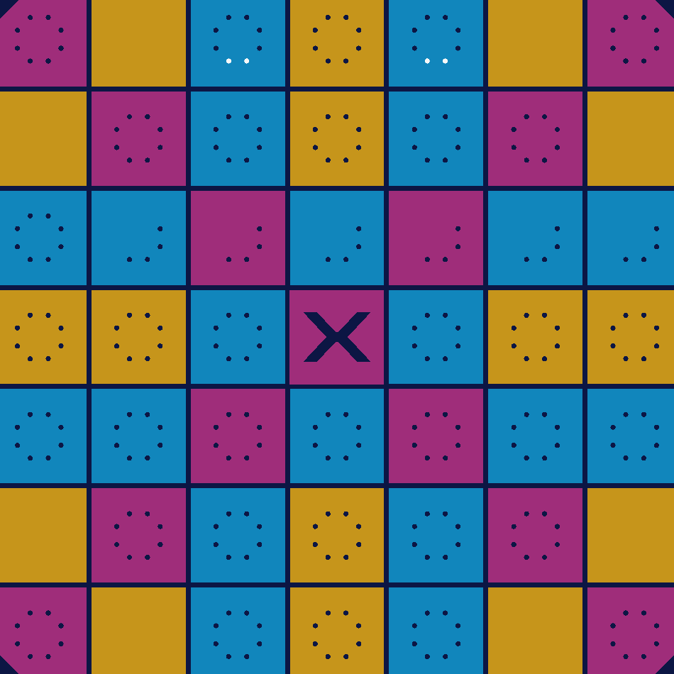

*Face-on: the magenta MakerX X across both diagonals, off-X floors alternating
gold and electric blue by depth, the traced MakerX letterform debossed in the
flush centre cell.*

### Why it exists

v1 is 250 mm, which overlaps the 18 × 28 mm front-left exclusion. The only way to
print it is the stopper-clip mod — and that clip disables the filament cutter, so
the AMS is off and colour has to be manual swaps. v2 solves it by shrinking the
module until a prime tower fits *beside* it:

```
module at x [4,194], y [30,220]   ->   54 mm free column at x [198,252]
```

That column is enough for a four-filament prime tower. Which means v2 can colour
**per cell** instead of per height band — and that is what makes the full-face
MakerX X possible.

| | v1 | v2 |
|---|---|---|
| Module | 250 × 250 × 52 mm | **190 × 190 × 52 mm** |
| Printer | needs stopper-clip mod | **stock, no mod** |
| AMS | unavailable (clip kills the cutter) | **available** |
| Colour | 6 manual swaps, height bands | **per-cell, or height bands** |
| Cell width | 34.04 mm | 25.60 mm |
| `f_high` | 5038 Hz | **6699 Hz** |
| Mass | 699 g | **451 g** |
| Joining | butt only | **bowtie keys** |

`f_low` (1786 Hz) and `f_design` (3063 Hz) are unchanged — they depend on well
depth, not tile size — so v2 gives up nothing at the bottom and gains 1.7 kHz at
the top. What it does give up is *single-panel* area: a 190 mm module is smaller
than a wavelength over more of its band, so arraying matters more. Which is what
the key is for.

### The key

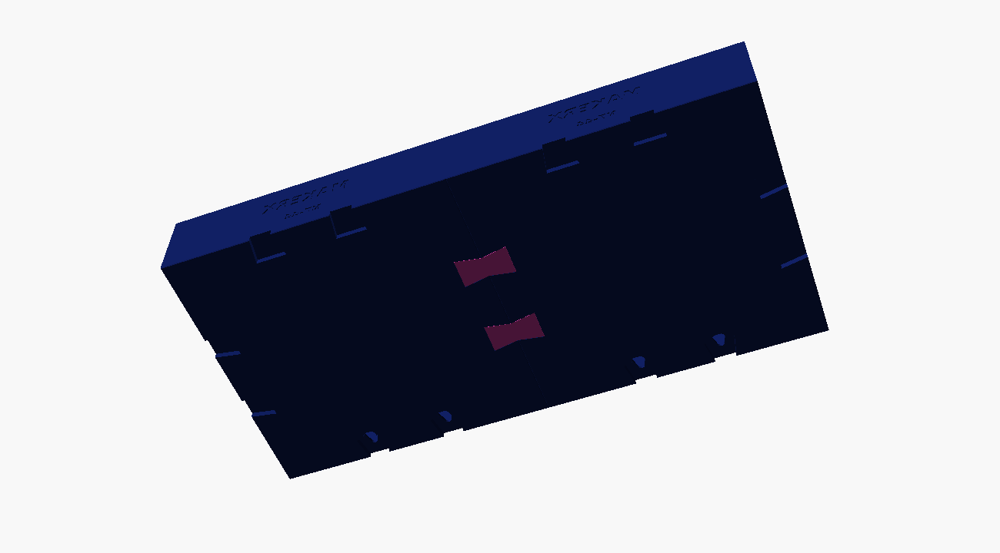

Each module edge carries **two blind bowtie pockets** in the back plate. Butt two
modules, drop a printed key into the paired pockets, and the joint is locked
in-plane — the flared ends cannot pass back through the pinched waist, exactly
like a woodworker's butterfly key.

| | |
|---|---|
| Key | 34 × 20 × 4 mm, 14 mm waist, **2.9 g**, ~8 min |
| `part="key"` | plain joiner |
| `part="key-mount"` | same plus a countersunk M4 — fixes the joint *and* the panel to the wall |
| `part="keyplate"` | 12 keys laid out on one plate, 33.9 g |
| `part="pair"` | two modules butted with keys in place, for inspection |
| `part="fit"` | interference gate — renders empty when the fit is right |
| Fit | 0.15 mm per side, push fit |

Why it is built this way:

- **On the back, not the face.** The face is the acoustic surface; a joiner there
  would put a flat land across every joint. The back plate is against the wall and
  otherwise dead area.
- **Blind pockets.** 1.6 mm of plate is left above each pocket, so no sealed cell
  cavity is breached and the Helmholtz mechanism is untouched. The pockets are
  flat-bottomed and open downward onto the build plate, so they are not overhangs
  — no supports, no bridging.
- **Modules butt at exactly 190.0 mm**, so the well grid stays continuous. The
  joint reads as a 2.7 mm land against a 1.35 mm internal fin.
- **Rotation-safe.** Pockets sit symmetrically about each edge's midpoint and use
  the same cell indices on all four edges (cells 2 and 4 at the default), so any
  edge mates any edge at any 90° rotation. Modules stay interchangeable, and
  changing `pattern_offset` for array modulation never breaks the key system —
  the pocket cells are auto-selected and scored by available cavity.

Assemble **face-down** on a flat surface: butt the modules, drop the keys in, then
lift onto the wall. Keys are captured once the panel is hung; use `key-mount` keys
at a few joints if you want them positively fixed.

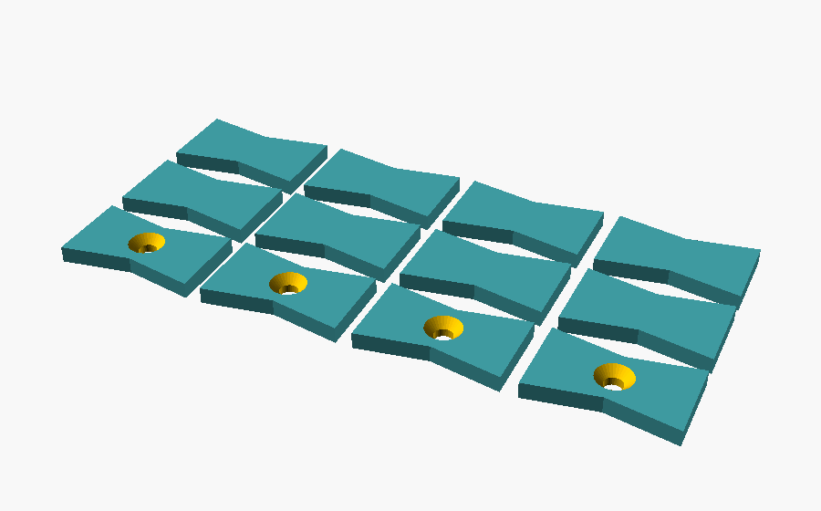

*One plate of keys: 12 in ~35 g. The front row is `key-mount` (countersunk M4),
the rest plain joiners.*

A 3 × 3 panel is 570 × 570 mm and needs 12 keys (~35 g).

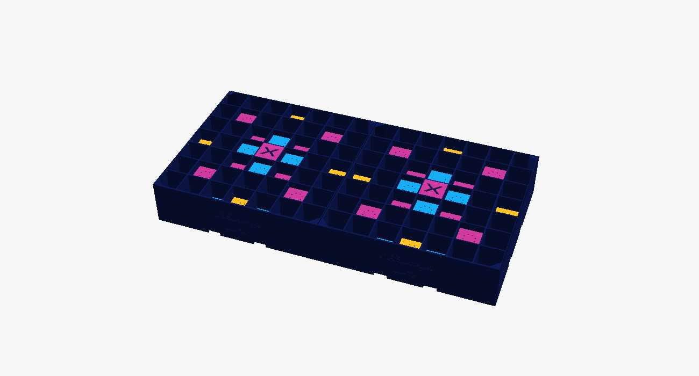

*Two modules butted at exactly 190.0 mm. The well grid runs straight through the
joint; each module keeps its own X badge.*

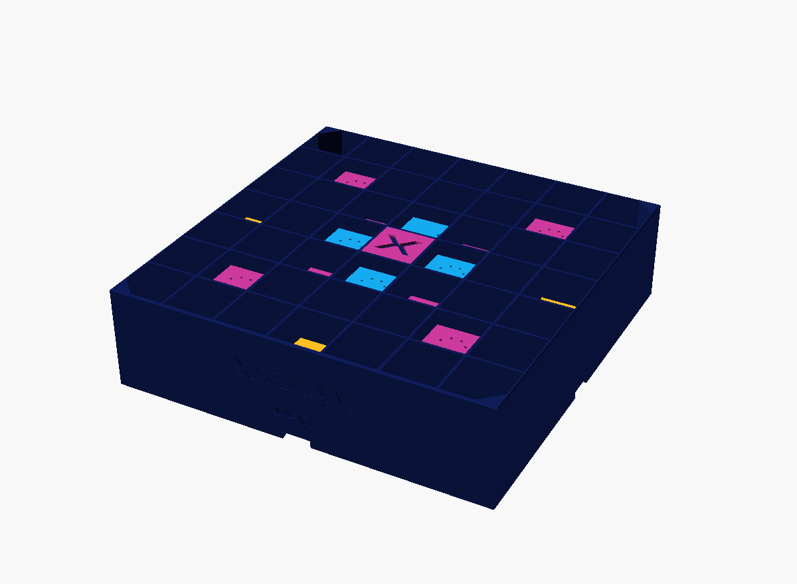

### Colour modes

```sh
-D 'colour_mode="logo_x"'   # default: per-cell, needs AMS + prime tower
-D 'colour_mode="strata"'   # v1 scheme: height bands, 6 manual swaps, no tower
```

**`logo_x`** paints the two diagonals magenta — at 7 × 7 that is what the MakerX
letterform reduces to — with off-X floors alternating gold and electric blue by
depth. Only the top 1.2 mm of each floor changes colour (`colour_skin`), so a
colour change costs a few layers rather than a whole body.

Honest trade-off: `logo_x` is a **face-on graphic**. Because only floor tops are
coloured, the module reads mostly navy from an oblique angle. `strata` bands the
fins themselves, so it keeps its colour from any viewing angle but cannot draw a
picture. Pick by where the panel will be seen from.

Both modes partition the module exactly:

| Mode | navy | magenta | gold | cyan | sum | vs module |
|---|---|---|---|---|---|---|
| `logo_x` | 325.98 | 9.95 | 12.49 | 15.47 | 363.89 | 363.88 cm³ |
| `strata` | 115.48 | 103.13 | 96.65 | 48.63 | 363.89 | 363.88 cm³ |

### Printing v2

Everything from the v1 print settings carries over. Differences:

- **Do not auto-arrange.** Bambu Studio will centre the module and collide with
  the exclusion. Place it manually at x 4…194, y 30…220 and let the prime tower
  take the right-hand column.
- Module ≈ **451 g**, ~16–20 h. Test coupon is 55.25 mm, 52 g, ~40 min.
- Print keys in mx-magenta so a disassembled panel is obvious, or mx-blue to
  vanish into the joint.
- If your holes run tight, raise `key_clear` rather than forcing a key in — PLA
  splits along layer lines.

### v2 parameters

| Parameter | Default | Notes |
|---|---|---|
| `key_pockets` | `true` | Set `false` for a standalone module with no joiner |
| `key_t` / `key_half` | 4.0 / 17 | Key thickness and reach each side of the joint |
| `key_end_w` / `key_waist_w` | 10 / 7 | Half-widths; waist must be smaller or it does not lock |
| `key_clear` | 0.15 | Per-side clearance |
| `key_boss_h` | 4.0 | Back-plate thickening that gives the pocket its depth |
| `colour_mode` | `"logo_x"` | or `"strata"` |
| `colour_skin` | 1.2 | Depth of the colour layer on floor tops |

`n_prime = 11` at 190 mm gives 15.8 mm cells — too small for both a keyhole and a
20 mm key. The model says so and names the fix; use a larger `tile_size`, a
smaller `key_end_w`, or `mount_style="none"`.

### v2 verification

Same gate as v1, on OpenSCAD 2026.07.20 (Manifold). All 13 `part=` values and 8
parameter variants build clean under `--hardwarnings`; every printable body is
**0 open edges, 0 non-manifold edges**; both colour modes partition exactly.
Plus one gate v1 did not need:

- **Key interference gate** (`part="fit"`) intersects the key with the module at
  its installed position. A correct clearance fit renders **empty**, and it does.
  The test is sensitive, not trivially empty: `key_clear=-0.5` yields 0.21 cm³ of
  collision and `key_pockets=false` yields 1.01 cm³.

Two bugs this caught during development, both now fixed: the corner posts' `fudge`
overlap landed on exactly the same plane as the fins', producing 30 zero-area
degenerate facets; and for odd `N` the pocket-cell search included the middle
cell, where `p` and `N-1-p` collapse to the same cell and each edge silently got
one pocket instead of two.

Residuals a print must settle: whether the 0.15 mm key fit is right on your
machine, and whether the bowtie holds a 900 g two-module panel without a
`key-mount` screw.

---

## Branding

Colours are the literal brand tokens from the MakerX site CSS
(`https://makerx.com.au/_astro/default.CCyKAxDS.css`), not eyeballed:

| Token | Hex | Used for |
|---|---|---|
| `--color-mx-blue` | `#0f1c57` | Tile face, fin grid, back plate — the dominant colour |
| `--color-mx-magenta` | `#cc3a9d` | Depth bands 1 and 4 |
| `--color-mx-gold` | `#ffc023` | Depth bands 2 and 5 |
| `--color-mx-electic-blue` | `#16acf2` | Depth band 3 (deepest accent) |
| `--color-mx-black` / `--color-mx-white` | `#0e0f10` / `#f2f2f2` | Not used in the model |

Also present in the site CSS but unused here: `--color-mx-capital-blue: #003fb5`.
The brand typeface is Neue Haas Grotesk (Adobe Typekit `umz1psf`) — not embeddable,
so the side-wall text uses DejaVu Sans Bold as a geometric stand-in. Change
`side_font` if you have Neue Haas installed locally.

The **MakerX "X"** debossed in the centre cell is traced from the actual wordmark
SVG (`viewBox="0 0 1300 260"`, glyph 6), normalised to unit width and embedded as
`MX_X_PTS`. It is the real letterform, not an approximation.

---

## How it works

Two mechanisms, both purely geometric — there is no foam, fibre or felt anywhere.

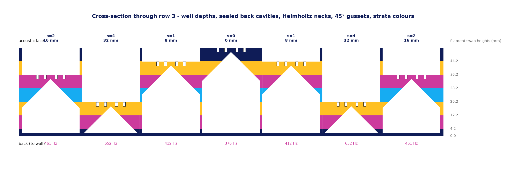

### 1. Diffusion — a 2D Schroeder quadratic-residue array

The face is a 7 × 7 grid of 49 wells. Well depth follows the 2D quadratic-residue
sequence `s(i,j) = ((i+m)² + (j+n)²) mod 7`, scaled so `s = 6` is 48 mm deep and
each step is 8 mm. Each well returns the incident wave with a different round-trip
phase, so the reflection is broken into lobes spread across the hemisphere instead
of one specular mirror image.

| Limit | Value | Meaning |
|---|---|---|
| `f_low` | **1786 Hz** | Deepest well = λ/4, so the phase spread across wells first reaches π |
| `f_design` | **3063 Hz** | Schroeder design frequency — where the sequence is optimally tuned |
| `f_high` | **5038 Hz** | Well width = λ/2; above this each well acts as an independent flat reflector |

Predicted normalised diffusion coefficient (vs. a flat plate of the same size)
**peaks at 0.86 near 3.15 kHz**, mean **0.51** across 1.6–5 kHz.

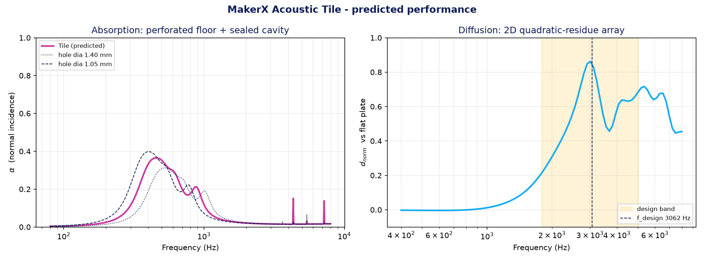
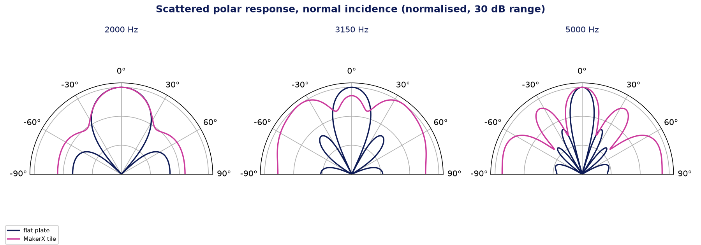

The polar plots are the honest picture: the flat plate concentrates everything
into one specular lobe; the tile spreads it. That is what a diffuser is for.

### 2. Resonant absorption — "trapping" the energy

You asked about total internal reflection. Worth being straight about this: **sound
in air cannot be totally internally reflected.** TIR needs two media with different
refractive indices and a critical angle; a tile in a room has air on both sides of
every surface, so there is no index contrast to exploit. Nothing shaped out of PLA
will TIR sound.

The mechanism that *does* achieve what you want — trap the energy and dissipate it
rather than reflect it — is a **resonator with a narrow neck**. At resonance the air
in the neck moves fast; viscous drag against the neck walls turns that motion into
heat. That is how micro-perforated absorbers work, and it needs no porous material.

So the tile does two things with it:

- **Every well is a quarter-wave resonator.** A well of depth *d* resonates at
  *c*/4*d*: 1786 Hz for the deepest, up to 10.7 kHz for the shallowest.
- **The dead volume behind each well floor becomes a Helmholtz resonator.** Under a
  shallow well there is up to 48 mm of otherwise-wasted space. Each floor is
  perforated with **8 × ⌀1.4 mm necks**, turning that space into a tuned cavity
  vented into the well. Because every well is a different depth, every back cavity
  is a different volume — so the 40 vented cells resonate across **376–922 Hz**
  instead of all piling onto one frequency.

| `s` | Cells | Well depth | Back cavity | ¼-wave | Helmholtz |
|---|---|---|---|---|---|
| 0 | 1 | 0 mm (flush, carries the logo) | 48 mm | — | 376 Hz* |
| 1 | 8 | 8 mm | 40 mm | 10719 Hz | 412 Hz |
| 2 | 8 | 16 mm | 32 mm | 5359 Hz | 461 Hz |
| 3 | 8 | 24 mm | 24 mm | 3573 Hz | 532 Hz |
| 4 | 8 | 32 mm | 16 mm | 2680 Hz | 652 Hz |
| 5 | 8 | 40 mm | 8 mm | 2144 Hz | 922 Hz |
| 6 | 8 | 48 mm | 0 mm | 1786 Hz | sealed (no cavity) |

\* The flush cell gets no necks — the logo deboss would break into its cavity — so
its 376 Hz resonator is not actually built. 1 of 49 cells, ~2 % of the area.

Predicted normal-incidence absorption **peaks at α = 0.35 at 500 Hz**, third-octave
mean **0.23** over 315–1000 Hz, and is essentially zero below 200 Hz and above
1.25 kHz.

**Set expectations honestly:** α ≈ 0.35 in a ~1.5-octave band is a useful bonus on
top of the diffusion, not a bass trap. A 250 mm tile cannot absorb 100 Hz — the
wavelength is 3.4 m. If you need low-end control you still want thick porous
absorbers or membrane traps in the corners. What this tile does well is kill
flutter echo and specular slap-back in the 1.8–5 kHz range where speech
intelligibility and stereo imaging live.

### Why N = 7

N sets a direct trade between the bottom and the top of the diffusion band.
`f_low` depends only on the deepest well (c/4d), so it is 1786 Hz for every N.
But `f_design` scales with `s_max / N` — which *rises* with N — while `f_high`
scales with 1/cell width, which also rises with N. So a small N tunes lower and a
large N reaches higher, and you cannot have both:

| N | Cells | Cell width | `s_max/N` | `f_design` | `f_high` | Usable span | Mass |
|---|---|---|---|---|---|---|---|
| 5 | 25 | 48.20 mm | 0.800 | 2858 Hz | 3558 Hz | 1.0 oct | 623 g |
| **7** | **49** | **34.04 mm** | **0.857** | **3062 Hz** | **5038 Hz** | **1.5 oct** | **699 g** |
| 11 | 121 | 21.17 mm | 0.909 | 3248 Hz | 8100 Hz | 2.2 oct | 849 g |
| 13 | 169 | 17.71 mm | 0.923 | 3298 Hz | 9685 Hz | 2.4 oct | 922 g |

N = 5 does tune slightly lower (2858 Hz) but its 48 mm cells crush the top end to
3.6 kHz, leaving barely an octave of useful band, and only five distinct depth
levels to build the phase grating from. N = 7 gives seven depth levels and 1.5
octaves for a modest 699 g. N = 11 and 13 buy real top-end reach, but at +150 g
and +223 g and a lot more print time — and by 9.7 kHz you are well past where room
reflections matter much.

Set `n_prime = 11` if you want the extra top end. Note N = 13's cells are too
small for a keyhole hanger, so it needs `mount_style = "none"`.

---

## The tile

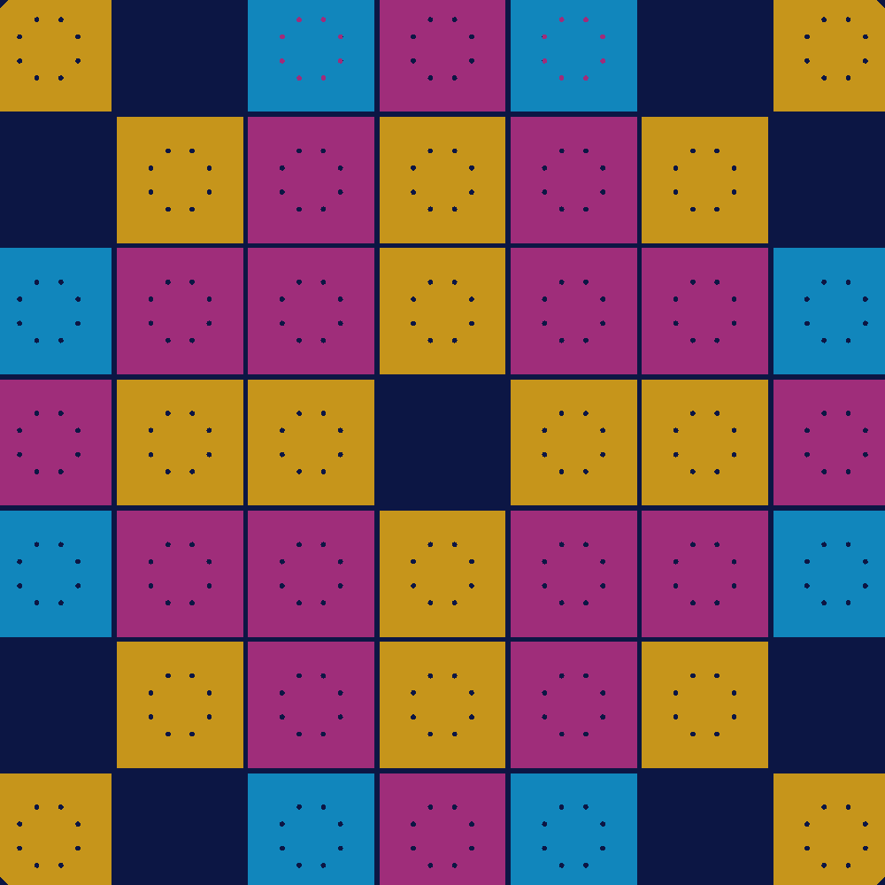

Depth pattern at the default `pattern_offset = [4, 4]` (`j = 6` is the top edge in use):

```
 j=6   4 6 3 2 3 6 4
 j=5   6 1 5 4 5 1 6
 j=4   3 5 2 1 2 5 3
 j=3   2 4 1 0 1 4 2      <- 0 is the flush cell carrying the MakerX X
 j=2   3 5 2 1 2 5 3
 j=1   6 1 5 4 5 1 6
 j=0   4 6 3 2 3 6 4
```

Key dimensions (all derived, all printed to stderr by the model):

| | |
|---|---|
| Outer size | 250.0 × 250.0 × 52.0 mm (needs the stopper-clip mod — see below) |
| Cells | 7 × 7 = 49, clear width 34.043 mm, pitch 35.393 mm |
| Open aperture | 90.9 % (fin/rim land 9.1 %) |
| Fin / rim / back plate | 1.35 / 1.8 / 1.6 mm |
| Well floor | 2.4 mm, 8 × ⌀1.4 mm necks on a ⌀17 mm ring |
| Solid volume | 563 cm³ → **≈ 699 g PLA** |

### Internal structure

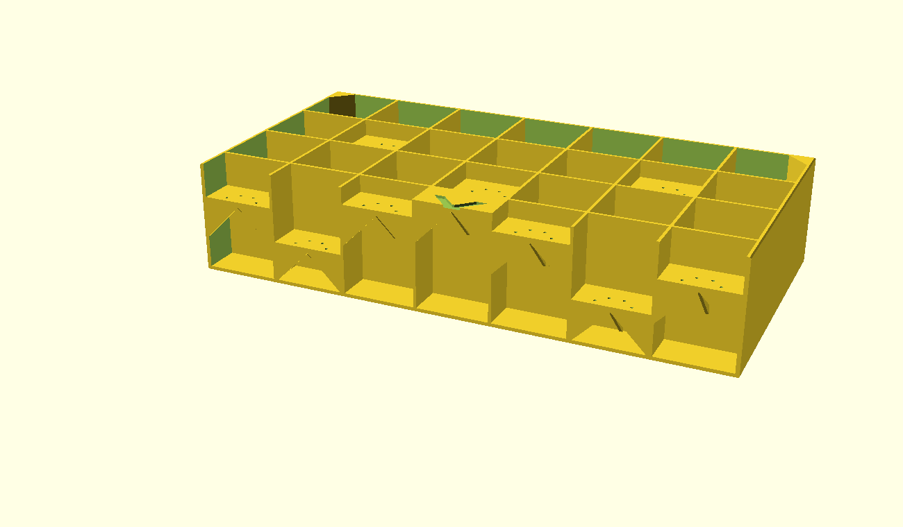

Printed **face-up**: back plate on the bed, wells opening toward the sky. Every fin
is a vertical wall, so nothing needs support. The only downward-facing surfaces are
the well floors' undersides, and those are *inside sealed voids* — nobody ever sees
or hears them.

Under each floor sit four **45° gussets** on the cell mid-lines. Each starts as a
sliver at the cell wall and grows inward by one layer-width per layer until it
reaches full half-width at the floor, so it is self-supporting. They cut the floor
bridge from 34 mm to 17 mm and stiffen the panel, for about 35 g.

The two keyhole cells get **no** gussets — a gusset runs exactly where the screw
head has to sit and slide. Those two floors bridge the full 34 mm, which PLA
handles fine.

---

## Printing

Verified on OpenSCAD 2026.07.20 (Manifold backend). Target: Bambu Lab X1C,
0.4 mm nozzle, 0.20 mm layers, PLA.

> **Bed exclusion — read this before slicing.** The Bambu X1/P1 reserve an
> **18 × 28 mm front-left corner** of the bed for the filament-cutter stopper
> (`bed_exclude_area` in the machine profile). The stock usable square is
> therefore **~220 mm auto-centred, ~238 mm shoved hard right — not 256 mm.**
> A 250 mm tile overlaps that corner *either way*, and Bambu Studio will refuse
> to slice it cleanly.
>
> Two options:
>
> 1. **Fit Bambu's stopper-clip mod** ([print volume guide](https://wiki.bambulab.com/en/knowledge-sharing/print-volume-limitations))
>    and clear "Excluded bed area" in the printer settings. This frees the full
>    256 mm bed and keeps the tile at 250 mm. **The clip disables the filament
>    cutter, so the AMS cannot be used** — print single-filament with manual
>    swaps. That is exactly what the colour scheme below is designed for, so you
>    lose nothing. Keep the chamber floor clear of debris.
> 2. **Stay stock**: `-D 'tile_size=220' -D 'bed_clip_fitted=false'`. Everything
>    scales; cell width drops to 29.7 mm and `f_high` rises to ~5.8 kHz.
>
> The model asserts this: with `bed_clip_fitted = false` a 250 mm tile fails the
> build with a message naming both fixes.

| Setting | Value |
|---|---|
| Material | PLA (see below for why not PETG) |
| Layer height | 0.20 mm — every colour boundary is a multiple of this |
| Perimeters | 3 (1.35 mm) — fins are exactly 3 perimeters, no infill or gap fill |
| Infill | 15 % gyroid (only floors, posts and pads have any) |
| Supports | **None.** Do not enable them. |
| Bed | 60 °C, 5 mm brim (250 mm of first layer is real corner-lift risk) |
| Enclosure | Door **open** — PLA in a hot chamber softens and the tall fins lean |
| Cooling | 100 % fan from layer 2 |
| Bridging | Bridge flow ~110 %, bridge speed ≤ 30 mm/s |
| Estimate | ~25–30 h, ≈ 699 g |

Slicer notes:

- **Turn "detect thin walls" OFF** and "ensure vertical shell thickness" ON.
- The sealed voids are **intentional**. Ignore any "internal void" hint and do
  **not** add drain holes — they are mechanism 2.
- PLA over PETG because the 1.4 mm necks and 1.35 mm fins need dimensional
  accuracy, PETG stringing tends to veil the neck holes, and PLA's higher stiffness
  keeps the fins from resonating and re-radiating. PETG's toughness buys nothing on
  a wall-hung part.

### Print the coupon first

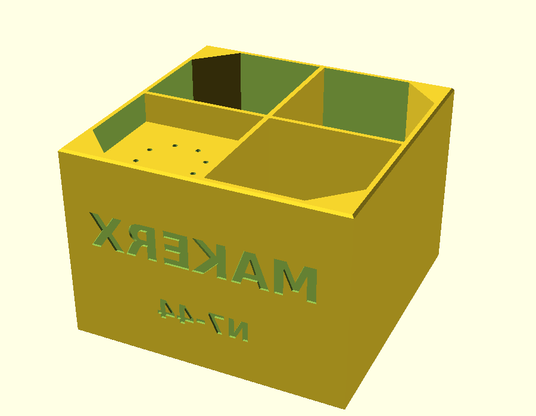

```sh
openscad --backend=Manifold -o coupon.stl -D 'part="coupon"' makerx-acoustic-tile.scad
```

73.0 × 73.0 × 52 mm, ~82 g, about an hour. It uses the **real** cell size and contains
wells at `s` = 1, 3, 5 and 6 — so it exercises the deepest well, the shallowest
gusset, a full-depth gusset, and the no-neck case. Check that the neck holes are
open and the floor top surfaces are clean before committing 25 hours.

### Colour: 4 filaments, 6 swaps, no prime tower

This is the part that makes a 250 mm multi-colour tile possible at all. Colour is
banded by **height**, not by cell, so **only one filament is ever active at a given
Z**. That means no prime tower and no purge blocks — just six filament changes at
layer boundaries, done by hand.

That is not merely convenient, it is the only route: a 250 mm tile needs the
stopper-clip mod to clear the bed exclusion, and the clip disables the AMS. A
per-cell colour scheme needing a prime tower could not have been printed at this
size on this printer.

| Swap | At Z | Layer (0.2 mm) | Filament | What it colours |
|---|---|---|---|---|
| — | 0.0 mm | 1 | **navy** `#0f1c57` | Back plate + the deepest wells' floors |
| 1 | 4.2 mm | 22 | **magenta** `#cc3a9d` | |
| 2 | 12.2 mm | 62 | **gold** `#ffc023` | |
| 3 | 20.2 mm | 102 | **electric blue** `#16acf2` | |
| 4 | 28.2 mm | 142 | **magenta** `#cc3a9d` | |
| 5 | 36.2 mm | 182 | **gold** `#ffc023` | |
| 6 | 44.2 mm | 222 | **navy** `#0f1c57` | The acoustic face + the flush logo cell |

260 layers total. Each boundary sits exactly one layer *above* a floor's top
surface, so no floor is ever split across two filaments.

The result reads as a topographic map: a navy grid at the face, with each depth
level a different colour as you look down into it, and navy again at the very
bottom of the deepest wells.

In Bambu Studio: *Prepare → right-click the layer slider → Add pause*, at each
layer above, then swap the spool by hand when it stops.

The four colour bodies can also be exported separately, for a printer **without**
the X1/P1 bed exclusion (or a tile shrunk to ≤220 mm, where the AMS is still
available):

```sh
for c in navy magenta gold cyan; do
  openscad --backend=Manifold -o "tile-$c.stl" -D "part=\"$c\"" makerx-acoustic-tile.scad
done
```

Load the four as a single multi-part object. Their volumes sum to exactly the
one-piece tile (189.27 + 151.74 + 147.55 + 74.82 = 563.38 cm³ against the tile's
563.37 cm³), so the partition is exact — no overlaps, no gaps. This route needs a
prime tower, which a 250 mm tile has no plate room for **and** which the stopper
clip rules out anyway — so on a 250 mm X1C tile, use the manual swap table above.

---

## Arrays

Tiles butt at exactly 250.0 mm. A 2 × 2 array is 500 mm, 3 × 3 is 750 mm.

**Do not print the same tile several times.** A periodic array of identical
diffusers behaves like one big grating and re-concentrates energy into lobes at
the array's periodicity — which undoes much of the point. The fix is *modulation*:
change `pattern_offset` per tile.

```sh
openscad -o tile-44.stl -D 'part="tile"' -D 'pattern_offset=[4,4]' makerx-acoustic-tile.scad
openscad -o tile-00.stl -D 'part="tile"' -D 'pattern_offset=[0,0]' makerx-acoustic-tile.scad
openscad -o tile-13.stl -D 'part="tile"' -D 'pattern_offset=[1,3]' makerx-acoustic-tile.scad
openscad -o tile-25.stl -D 'part="tile"' -D 'pattern_offset=[2,5]' makerx-acoustic-tile.scad
```

A cyclic shift of the sequence origin is still a valid quadratic-residue
diffuser with an identical depth histogram, so all 49 offsets weigh the same,
print the same, and absorb the same. Verified:

| `pattern_offset` | d_norm @2 kHz | @3 kHz | @4 kHz | α @500 Hz |
|---|---|---|---|---|
| `[4,4]` (default) | 0.31 | 0.86 | 0.58 | 0.35 |
| `[0,0]` | 0.16 | 0.69 | 0.70 | 0.35 |
| `[1,3]` | 0.16 | 0.69 | 0.70 | 0.35 |
| `[2,5]` | 0.10 | 0.48 | 0.78 | 0.35 |

Absorption is identical across all offsets, as expected — the cavity population
does not change. Diffusion trades between bands rather than getting better or
worse, which is exactly the property that makes a mixed array flatter than any
single tile: the variants' lobes do not line up.

The variant label is debossed on the tile's side wall (`N7-44` etc.) so you can
tell them apart when laying out an array.

Each tile also carries the MakerX **X** in its flush centre cell. For a large
array, consider `logo_badge = false` on all but a few tiles.

---

## Mounting

Default `mount_style = "keyhole"`. Two keyhole hangers are cut through the back
plate near the top edge, automatically placed in top-row cells that have at least
12 mm of back volume — so changing `pattern_offset` never breaks the mounting.
The screw head passes through a ⌀9 mm opening, then the tile drops 7 mm so the
shank rides in a 4.6 mm slot.

The back plate is only 1.6 mm, so each keyhole sits on a locally thickened
**4 mm pad** (5.6 mm total). The screw head then sits inside the cell's sealed
cavity, which is free clearance — no extra pocket needed. At the default offset
the hangers land at **x = ±35.4 mm, y = +106.2 mm** from the tile centre, i.e.
70.8 mm apart and 18.8 mm below the top edge. Use two #8 / M4 screws into plugs or
studs.

Two consequences worth knowing:

- Those two cells lose their Helmholtz resonators (the cavity now vents to the
  wall). That is 2 of the 40 vented cells — negligible, and the model's area
  weighting already ignores far more than that.
- Keyholes define an "up", so the tile can only be rotated 180°, not 90°. Offset
  modulation is the better technique anyway. If you want free rotation, set
  `mount_style = "none"` and hang it on VHB tape or Command strips — at 699 g,
  use strips rated well above that.

Solid triangular posts in all four corners resist first-layer corner lift and
give you something to grip. They are always present and add ~12 g.

---

## Parameters

Everything below is a named parameter at the top of the `.scad`. The model
`assert()`s its own contracts, so an out-of-range change fails the build with a
message instead of producing a bad STL.

| Parameter | Default | Notes |
|---|---|---|
| `part` | `"tile"` | `tile`, `preview`, `section`, `coupon`, `navy`, `magenta`, `gold`, `cyan` |
| `tile_size` | 250 | Tiles butt at this. Asserted against the plate *and* the bed exclusion. |
| `bed_clip_fitted` | `true` | Stopper-clip mod fitted. Set `false` + `tile_size=220` to stay stock. |
| `bed_exclude_x` / `_y` | 18 / 28 | X1/P1 front-left exclusion. Set 0 for other printers. |
| `n_prime` | 7 | 5, 7, 11, 13. Asserted prime. |
| `pattern_offset` | `[4,4]` | Array modulation; any `[m,n]` in 0..N-1 |
| `well_depth_max` | 48 | 32 = slim (≈517 g), 48 = default, 70 = max reach (≈861 g) |
| `floor_t` | 2.4 | Also the Helmholtz neck length |
| `fin_t` | 1.35 | 3 perimeters. 0.90 saves ~76 g. Do not go below 0.90. |
| `neck_dia` / `neck_count` | 1.4 / 8 | `1.2` / `12` raises mean α 0.23 → 0.26 if your flow is well calibrated |
| `floor_gussets` | `true` | `false` saves ~35 g but every floor then bridges 34 mm |
| `mount_style` | `"keyhole"` | or `"none"` for adhesive mounting |
| `logo_badge` | `true` | Debossed MakerX X on the flush cell |
| `side_text` / `variant_text` | `"MAKERX"` / auto | Debossed on the outer frame wall |

Presets worth knowing:

```sh
# Slim: 36 mm thick, ~517 g, f_low rises to 2680 Hz, f_design 4594 Hz
-D 'well_depth_max=32' -D 'fin_t=0.9' -D 'gusset_t=0.9'

# Maximum reach: 74 mm thick, ~861 g, f_low drops to 1225 Hz, f_design 2100 Hz
-D 'well_depth_max=70'

# Higher top end: f_high 5.0 -> 8.1 kHz, 121 cells, ~849 g
-D 'n_prime=11'
```

`n_prime = 13` makes cells too small for a keyhole (17.7 mm) and the model says so;
use `-D 'n_prime=13' -D 'mount_style="none"'`.

---

## Verification

Built and measured with OpenSCAD 2026.07.20, Manifold backend.

- **Build gate** — all 8 `part=` values and 12 parameter variants compile with
  exit 0, non-empty STL, and stderr clean of `ERROR`/`WARNING`/`Assertion`/
  manifold complaints (with `--hardwarnings`). Top-level object reports
  `(manifold)` and `Status: NoError`, not `(PolySet)`.
- **Measured bounding box** — 250.00 × 250.00 × 52.00 mm, matching the intended
  envelope exactly. Every variant holds 250 × 250 in XY. Note this fits the X1C
  plate only with the stopper-clip mod fitted (see the bed-exclusion note above);
  the model asserts it.
- **Mesh integrity** — independent STL parse of the printable bodies (`tile`,
  `coupon`, and all four colour bodies): **0 open edges, 0 non-manifold edges**.
  (`preview` and `section` are stacked visualisation solids and do report shared
  faces — they are not print bodies.)
- **Colour partition** — the four colour bodies sum to 563.38 cm³ against the
  one-piece tile's 563.37 cm³: exact, no overlap or gap.
- **Negative contract tests** — six deliberately invalid configurations
  (`rim_t=2.0`, `floor_t=2.35`, `fin_t=1.0`, `n_prime=9`, `neck_dia=0.8`,
  `tile_size=260`) each fail the build with a named, actionable message.
- **Contracts** — 15 `assert()`s covering plate fit, minimum printable feature
  sizes, perimeter multiples, primality of `n_prime`, neck-ring clearance, badge
  fit, and keyhole fit. `n_prime = 13` correctly fails the keyhole assert with a
  message naming the fix.
- **Gusset self-support** — verified by measurement, not by eye: at the gusset's
  lowest layer material exists only at x = ±17.01 mm (the cell walls), widening to
  the full ±17.01 → 0 span at the floor. Each layer overhangs the one below by one
  layer-width, i.e. 45°.

**Residuals that need a real print** — no simulation settles these:

1. Whether the ⌀1.4 mm necks come out open. They should land ~1.2 mm; the coupon
   exists to check this.
2. Bridge quality on the 17 mm quadrants and the two 34 mm keyhole-cell floors.
3. Whether a 250 mm PLA first layer stays down without corner lift.
4. Actual acoustic performance. The predictions below are analytic models, not
   measurements.

---

## Model limitations

`scripts/acoustic_model.py` is a first-principles analytic model, not BEM/FEM. It
is good enough to choose geometry on evidence, and it should not be read as a
measurement.

**Diffusion** uses the Kirchhoff/Fraunhofer phase-grating approximation: each well
is a piston carrying its own round-trip phase, summed in the far field with a
square-aperture directivity. It therefore ignores inter-well coupling, scattering
off the fin edges, and the finite panel's edge diffraction, and it assumes the well
is wide compared to its own boundary layer. It is normal incidence on a −90…+90°
receiver arc, reduced per ISO 17497-2's autocorrelation formula and normalised
against a flat plate of identical size. Real measured `d` for printed diffusers
typically comes in somewhat below this kind of prediction.

**Absorption** uses a transfer-matrix stack per cell: Maa's (1998) micro-perforated
plate impedance for the floor, a lossless rigid-backed cavity behind it, and the
well itself as a lossy duct with Kirchhoff viscothermal wall attenuation, giving
a quarter-wave transformer to the panel face. Then area-weighted across all 49
cells with the fin land counted as perfectly rigid. Caveats:

- **Normal incidence only.** A real room is diffuse; α at random incidence differs.
- **As-printed hole diameter dominates the result.** The model assumes 1.4 mm
  nominal prints at 1.20 mm. The figures plot ±0.2 mm around that so you can see
  the sensitivity — it is not small.
- Cavity volume is modelled as a plain box. The gussets remove 1–6 % of it
  depending on depth, shifting the Helmholtz frequencies up by under 3 %.
- PLA walls are assumed perfectly rigid. Panel resonance and any air leakage
  through layer lines are not modelled, and both would reduce Q.
- The one flush (`s = 0`) cell has no necks — the deboss would break into it — so
  the 376 Hz resonator is drawn in the table but not built. It is 1 of 49 cells,
  ~2 % of the area.

Run `python3 scripts/acoustic_model.py --sweep` to see the neck design study the
1.4 mm × 8 default came from: absorption improves monotonically as holes get
smaller and more numerous (a standard micro-perforate result), and the default sits
where that curve meets what a 0.4 mm nozzle will reliably keep open rather than at
the mathematical optimum.

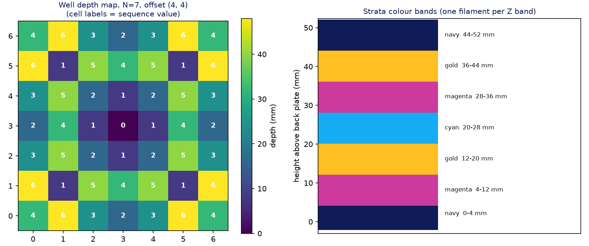
