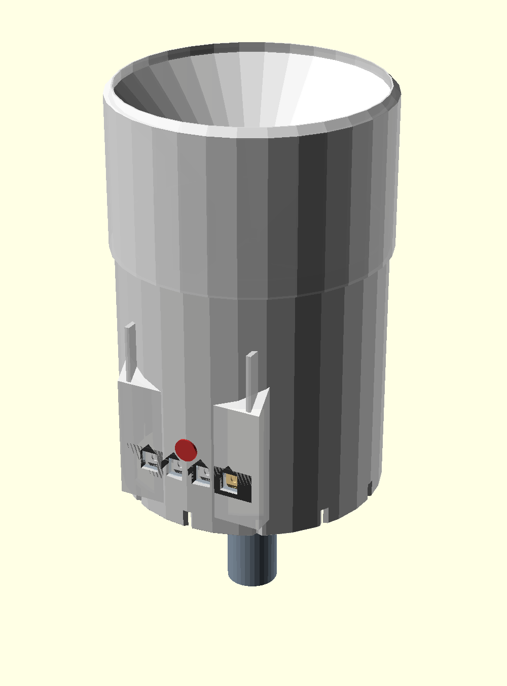
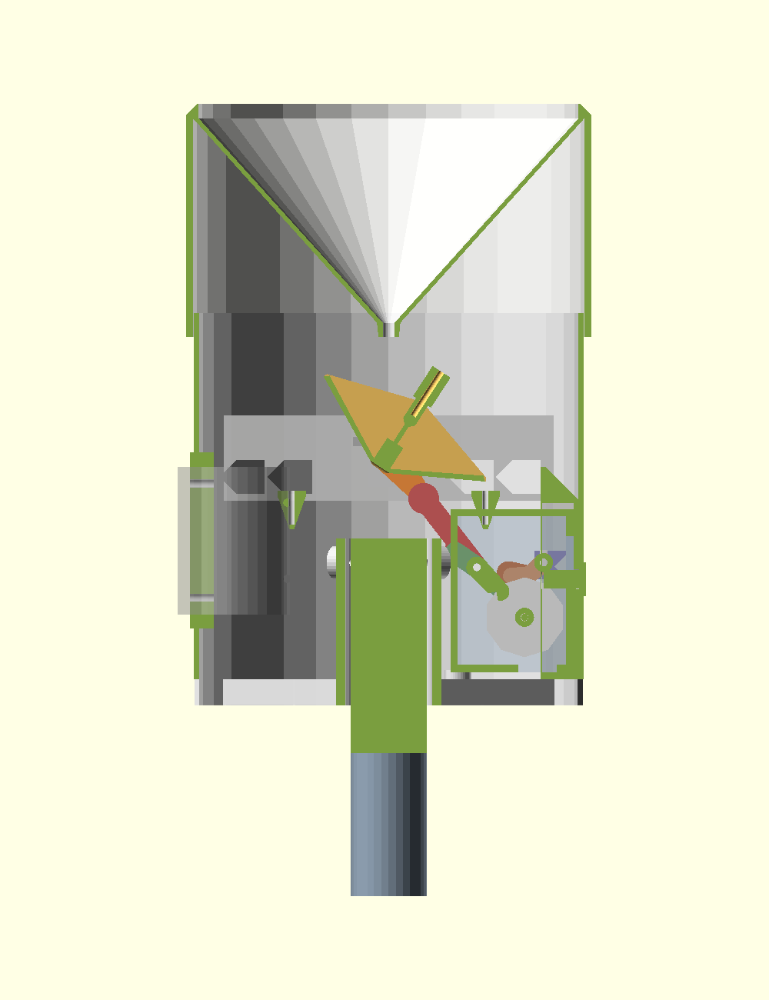
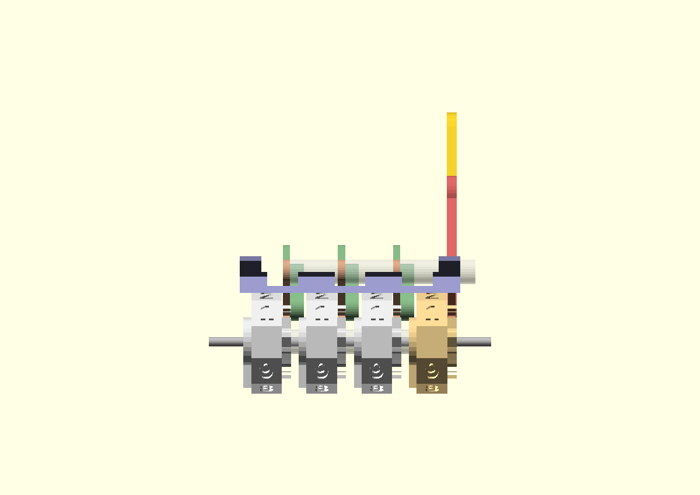
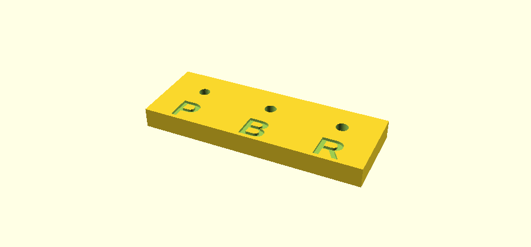
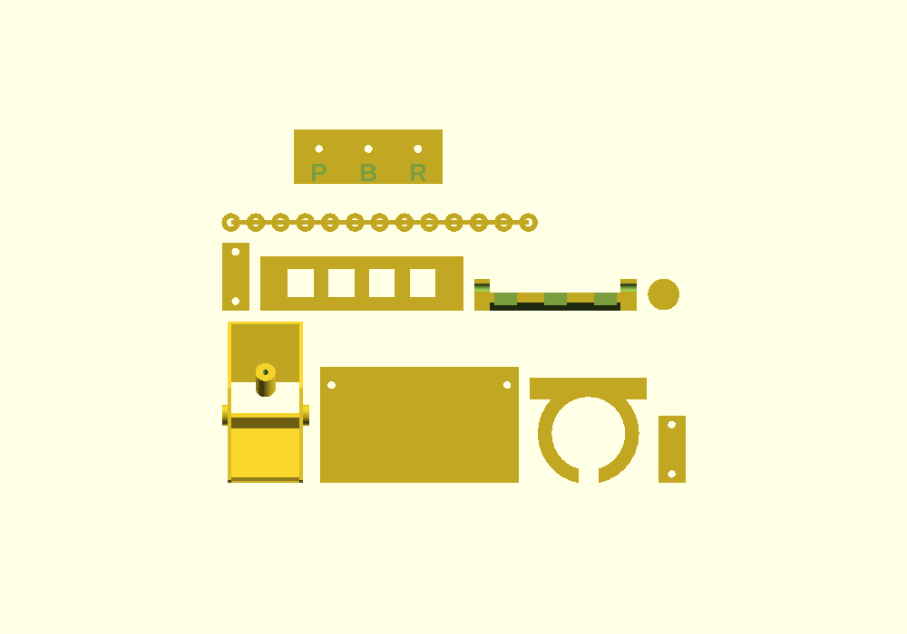
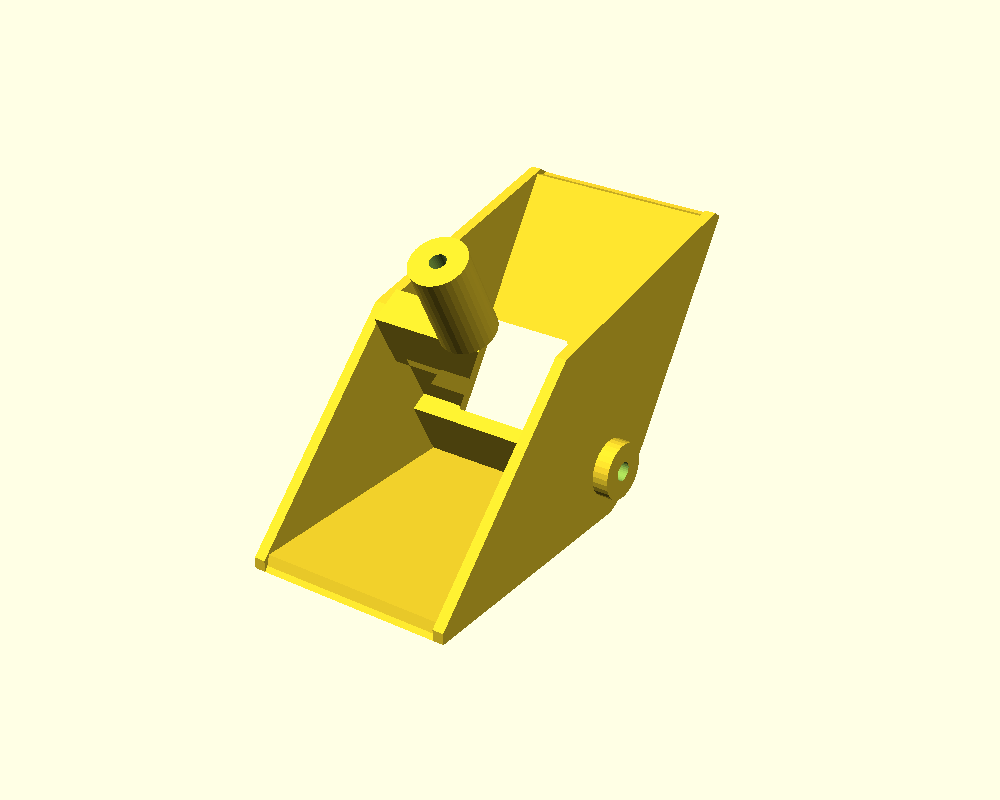
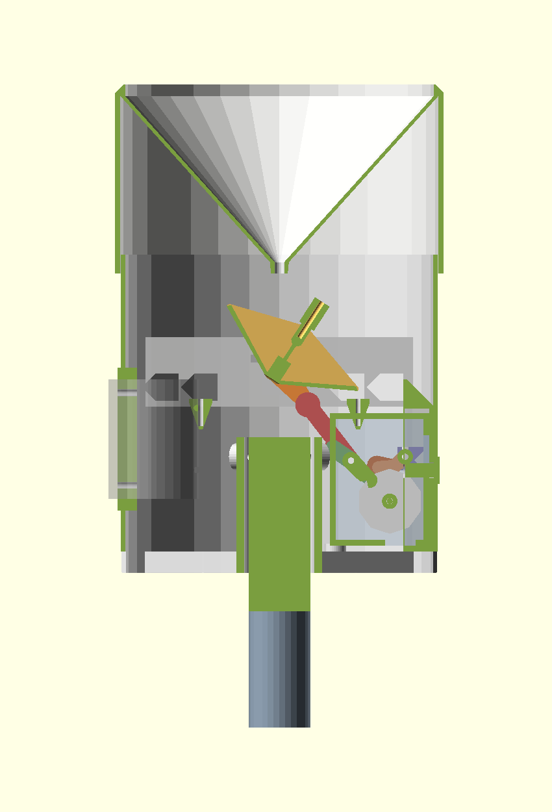

# Mechanical Rain Gauge — Opus5.0 v2

A fully mechanical rain gauge. No electronics, no battery, no sensor. Rain is caught by a
WMO-standard 200 cm² collector, quantised by a tipping-bucket see-saw, and totalised on a
four-digit "old meter" drum register reading **0000–9999 mm**, with a push-button zero reset.

**One displayed count = 1.000 mm of rain.** 10 mm of rain reads 0010.



---

## At a glance

| | |
|---|---|
| Collector catch area | **200.0 cm²** (WMO standard) → rim ID **159.58 mm** |
| Resolution on the dials | 1 mm (least significant drum) |
| Range | 0000–9999 mm |
| Tipping bucket | 0.5 mm of rain per tip = **10.0 mL** per chamber |
| Counts per tip | 1 count per **2** tips (one full see-saw cycle) |
| Rest tilt | ±33°, chamber floor 28° |
| Assembled size | Ø170 × 253 mm |
| Mount | **pole-top socket**, Ø32 pole, coaxial, ±3° levelling |
| Design rim height | 1000 mm above ground (pole stands 817 mm proud) |
| Largest single part | funnel, Ø170 × 98 mm — fits the X1C 220 mm bed |
| Printed parts | 17 distinct, 24 pieces total |
| Hardware | 3 mm steel rod, a few M3 screws/nuts. Nothing else. |
| Springs | **none** — every return is by gravity |
| Supports | **none** on any part |

---

## The standards research this is built on

**Collector size.** The WMO recommends a collector orifice of at least 200 cm², typically in
the 200–500 cm² range. **200 cm² is the most widely used size worldwide** among meteorological
services, and corresponds to a rim diameter of 159.58 mm — conveniently close to the ~150 mm
originally asked for, so this design is standards-compliant *and* the requested size. The other
common class is 400 cm² (225.7 mm).

**Why the rim matters so much.** The catch area is defined by the *inner* diameter at the rim.
The rim must be sharp-edged, vertical inside, bevelled outside, and level; a rolled or burred
rim deflects droplets and changes effective catch by 1–3 %. This model gives the rim a 6 mm
vertical inner reference wall (that wall *is* the catch area), a 0.9 mm land, and a 45° external
bevel. **A 0.9 mm land is not a knife edge** — see [Accuracy, honestly](#accuracy-honestly).

**Calibration identity.** 1 mm of rain over 1 cm² = 0.1 mL. So 200 cm² × 0.5 mm = exactly
10.0 mL per tip. Standard tipping resolutions are 0.1 / 0.2 / 0.5 / 1.0 mm per tip; 0.5 mm is a
recognised resolution class.

**Mechanism precedents.** The tipping bucket in general use descends from Kahl & Guidi,
US 3,705,533 — twin chambers back-to-back on a low-friction pivot, alternately filling and
tipping. Historically these drove a *pen recorder* rather than a counter, because the available
energy per tip is tiny; that constraint is what shapes this whole design. For the register,
Veeder-Root style counters use a single-tooth driver with a lock-by-rim, and odometers use a
mutilated transfer pinion. Both need radius matching to ±0.02 mm, which FDM cannot hold, so
this design instead uses the **lug-and-pawl carry of a hand tally counter**, which is
tolerance-forgiving. Zero-reset in watch and counter practice is a heart cam struck by a
hammer; this design gets the same result with gravity instead (see below).

Sources are listed at the [end](#sources).

---

## The two equations that set the whole design

Everything else is downstream of these. Both are worth understanding before changing anything.

### 1. Energy per working stroke

The see-saw has to do mechanical work on the register. Integrating the net torque over a
symmetric swing, the restoring-moment term cancels exactly and you are left with:

```
E = 2 · m · y_w · sin(rest_tilt)
```

where `m` is the tip mass (10.0 g of water) and `y_w` is the **water centroid's distance from
the pivot axis** (12.80 mm here). With rest_tilt = 33°:

```
E = 2 × 10.0 g × 12.80 mm × sin 33°  =  139.5 g·mm  =  1.368 mJ
```

The striking consequence: **E does not depend on the counterweight, the pivot height, or the
pawl lever ratio.** Leverage only trades force for stroke. The only ways to get more energy are
a bigger `m` (a bigger collector), a longer chamber (bigger `y_w`), or more tilt.

Against that budget, advancing one drum against a light gravity click (design target
0.15 N·mm) over 36° costs 0.094 mJ. The worst case is a triple carry — 0999 → 1000, where four
stages step at once — and it does **not** simply add up. Each carry stage drives its drum 36°
while its own source turns only `carry_sweep`, so it *multiplies* torque by
`carry_ratio = 36/carry_sweep`, and that compounds over three stages:

```
load factor  =  1 + k·(r + r² + r³)        r = carry_ratio = 1.52
```

where `k` is how much lighter the upper clicks are. With four *identical* clicks the factor is
**8.3** and the margin collapses to 1.7× — which is the trap here, because that number is
invisible if you model the carry as four equal loads. The tens/hundreds/thousands drums step
10×, 100× and 1000× less often than the units drum, so their clicks need far less preload:
a smaller mass boss (3.4 mm vs 5.0 mm radius, so `k` ≈ 0.46) cuts the factor to **4.38** and the
worst-case load to 0.413 mJ — a **3.31× margin**. That is why `click` and `click_light` are two
different printed parts, and why making them identical would quietly halve the safety margin.

### 2. Calibration robustness

The trip volume is set by a moment balance, and differentiating it gives a blunt result:

```
Δ(trip volume) / trip volume  =  Δz_cog / bal_arm        where bal_arm = z_cog − pivot_z
```

The fractional error in trip volume per millimetre of centre-of-gravity error is exactly
`1/bal_arm`. A printed shell's CoG can only be predicted to a millimetre or two, so **bal_arm
must be large.** Solving the balance:

```
bal_arm = m · [ y_w · cot(rest_tilt) − (z_w − z_cog) ] / (M + m)
```

so a **shallow rest tilt and a light bucket** are what buy accuracy. Here bal_arm = 7.25 mm,
i.e. **13.8 % of trip volume per mm of CoG error** — which is why the adjustable stop screws
are essential rather than a luxury.

### Why the bucket is printed at an angle

These two equations pulled hard against printability, and resolving that is the key move in
the design.

A chamber only empties completely once tilted **past its own floor angle**, so the floor angle
forces the rest tilt. An earlier revision used a 46° floor — the shallowest a floor's
*underside* can be and still print unsupported — which forced a 51° rest tilt. At 51° the water
sits almost directly over the pivot, collapsing `bal_arm` to 3.5 mm and making trip volume swing
**29 % per mm** of CoG error. Unusable.

The fix: **print the bucket rotated by the floor angle.** One chamber's underside then lies
flat on the bed and the other sits at 2 × 28 = 56°, both self-supporting, for *any* floor
angle. That removed the printability constraint entirely and freed the tilt down to 33°.

| | 46° floor / 51° tilt | **28° floor / 33° tilt** |
|---|---|---|
| balance arm | 3.50 mm | **7.25 mm** |
| trip-volume error per mm of CoG error | 29 % | **13.8 %** |
| tip energy | 1.44 mJ | 1.37 mJ |
| nozzle window | 7.4 mm | **15.6 mm** |
| supports needed | none | none |
| stop screws possible? | **no valid position** | yes, on the lip |

The last row matters as much as the first: at 33° the drip lip becomes the *unique* lowest
point of the swept envelope, which is what finally allows a stop that is touched only at full
tilt and never fouls mid-swing. The model asserts this rather than trusting it.

---

## How it works



1. **Collector.** Rain enters the 159.58 mm rim, runs down a 42° cone (steeper than the 45°
   from horizontal that WMO wants, to limit splash-out and wetting loss) to a single Ø5 mm
   drip nozzle on the axis.
2. **Water goes into the RAISED chamber.** This is the part that surprises people. The centre
   blade stands 28.6 mm above the pivot, so at rest its top edge has swung ~16 mm toward the
   *low* side — which puts the centred nozzle on the *high* side of the blade. The computed
   nozzle window is 15.6 mm, against a 2.5 mm stream radius.
3. **Tip.** At 10.0 mL the see-saw goes over-centre, swings 66°, dumps that chamber over its
   drip lip (sharp top edge, so water releases cleanly instead of clinging and decalibrating
   the next tip), and presents the other chamber. Its lip lands on an adjustable M3 stop screw.
4. **Drive.** A single-lobe cam pressed on the pivot rod points straight at the drive pawl at
   one stop and is rotated 66° away at the other — so the pawl is pushed on one stroke and
   simply retreats on the other. **That is what gives 2 tips per count with only one pawl**, no
   second pawl and no timing race.
5. **Register.** The pawl's nose advances the units drum's 10-tooth ratchet by exactly one
   tooth (36° = 1 mm). A gravity click drops into the next root and blocks reverse.
6. **Carry.** Once per revolution the units drum's lug pushes a carry lever whose nose advances
   the tens drum one tooth. `lug_r` is deliberately only 1.5 mm above `ratchet_r`, which makes
   the follower and nose arms nearly equal and the carry close to 1:1 in torque — a large lug
   radius would force the source drum to supply several times the torque the driven drum needs,
   straight out of the energy budget. The source drum sweeps 29.2° of its available 36°.
7. **Drain.** Dumped water falls through the open bottom of the body and out the scalloped rim.
   There is no internal deck, which is also why nothing has to bridge-print.



### Reset

Press the button. Its flat face bears on a 45° chamfer on the lifter yoke; because the click
shaft can only move vertically in its slots, that push becomes pure lift. The yoke raises the
shaft and all four clicks bodily out of the teeth. Each drum then swings under its own internal
counterweight sector to roughly zero, and when the button is released the clicks drop into the
**nearest tooth — which is exactly digit 0.** Gravity supplies the authority, the ratchet
supplies the precision.

This deletes four heart cams, four hammers and all the lift/hammer sequencing a chronograph-style
reset would need, and it exploits a constraint the gauge has to satisfy anyway: **it must stand
level.** If the gauge is not vertical, the reset will not zero reliably — which is fine, because
an off-level rain gauge is not measuring correctly either.

### Kinematics are computed, not hard-coded

Every lever length, mounting angle, cam lift, and axial spacer length is *derived* in the .scad
from the shaft positions. Move a shaft and the whole linkage re-solves. This was not stylistic:
the first version had hand-entered angles and the renders showed the click nowhere near the
ratchet and the pawl pointing away from the cam. It also encodes the distinction that broke
that version — a **holding click wants a tangent arm** (nose moves radially to engage, blocks by
abutment) while a **driving pawl wants a radial arm** (nose moves tangentially to push a tooth).

Computed values, echoed on every build:

```
click:  len 21.19  mount  48.70°   contact (7.92, 9.02)
carry:  nose 17.00  foll 15.50  mount −43.60°   source sweep 29.18° of 36°
pawl:   nose 17.00  tail 34.74  mount 140.83°   internal −184.44°
cam:    lift 15.41  base r 8.59  lobe r 24  mount −72.17°
```

---

## Printed parts

Print in a **light colour**: white/light grey reflects UV, runs cooler, and makes the engraved
digits far more legible.

| Part | Qty | Model vol | Notes |
|---|---:|---:|---|
| `funnel` | 1 | 202 cm³ | rim UP as modelled. Cone grows from the nozzle at 42°, self-supporting |
| `body` | 1 | 357 cm³ | open end DOWN. Four gabled window apertures, raised window boss, integral pole socket |
| `bucket` | 1 | 16.9 cm³ | **as modelled = rotated 28°.** Rests on a 33 × 44 mm flat |
| `cassette` | 1 | 60 cm³ | floor down |
| `cassette_lid` | 1 | 13.5 cm³ | flat |
| `drum` | 4 | 7.4 cm³ | **axis vertical.** 0 % infill except the counterweight sector at 100 % |
| `click` | 1 | 0.6 cm³ | flat. Mass boss 100 % infill. **Units drum only** — heavy boss |
| `click_light` | 3 | 0.5 cm³ | flat. Tens/hundreds/thousands. Lighter boss on purpose — see the energy budget |
| `carry_lever` | 3 | 1.4 cm³ | flat |
| `drive_pawl` | 1 | 1.8 cm³ | flat |
| `drive_cam` | 1 | 1.3 cm³ | flat |
| `lifter` | 1 | 3.1 cm³ | flat |
| `reset_button` | 1 | 1.2 cm³ | upright |
| `spacers` | 1 | 5.8 cm³ | break-apart comb — 11 tubes, **lengths auto-derived** |
| `pivot_strap` | 2 | 1.8 cm³ | flat |
| `bezel` | 1 | 4.9 cm³ | flat |
| `post_mount` | 1 | 64 cm³ | optional — side clamp, only if not using the pole socket |
| `fit_test` | 1 | 9 cm³ | **print first** — rod-fit coupon, not part of the gauge |

**Total ≈ 980 g solid-equivalent**, so realistically 820–900 g of PETG including the infilled
parts. Most of that is the funnel and body shells. If that is too much: `body_wall` 2.4 → 2.0
and `skirt_wall` 2.8 → 2.4 saves roughly 15 %, and skipping `post_mount` saves 82 g.

Slicer settings are in the `PRINT SETTINGS` header of the .scad. The short version: PETG,
0.20 mm layers (0.12 mm for drum/click/carry_lever/drive_pawl/drive_cam), 5 walls on the shells
and 4 elsewhere, 20 % gyroid, 240 °C nozzle / 80 °C bed, 30–40 % fan. **Dry the filament
first** — strings inside a ratchet are a functional defect, not a cosmetic one.

### Print the fit-test coupon FIRST



`3mf/fit_test.3mf` — a 66 × 24 mm coupon with the three rod bores in it, two minutes to print.
**Do this before committing filament to anything else.** Try your actual 3 mm rod in each hole:

| Hole | Fit should be | Used by |
|---|---|---|
| **P** | firm push, no rotation | bucket pivot, drive cam, cassette side walls |
| **B** | turns freely, no perceptible rock | body pivot webs, pivot straps |
| **R** | turns freely with a little slop | drums, all levers, spacers |

If **P** won't take the rod, raise `hole_comp`. If **B** rocks, lower it. This matters because
**FDM prints holes undersize** — about 0.35 mm on a 0.4 mm nozzle, and PETG sits at the high end
because the inner wall oozes inward. Every bore in the model has that compensation added:

```
bore_press = rod_d + hole_comp          = 3.35  ->  ~3.00 printed
bore_bear  = rod_d + hole_comp + 0.15   = 3.50  ->  ~3.15 printed
bore_run   = rod_d + hole_comp + 0.30   = 3.65  ->  ~3.30 printed
```

Getting this wrong is not cosmetic. An earlier revision of this model specified the bores at their
*nominal* fit sizes with no compensation — so the "3.0 mm press fit" bucket pivot printed at
2.65 mm and no amount of pushing would get the rod in, and the nominally-free 3.4 mm drum bore
printed at 3.05 mm and would have seized the register solid. Two minutes with this coupon catches
that class of error before it costs you four drums and eleven spacers.

### Print jobs

`3mf/` holds **Bambu Studio project files with all settings already baked in** — open, review on
the plate, slice, print. No settings to dial in. Five jobs total:

| Job | File | Settings | Footprint |
|---|---|---|---|
| 1 | `3mf/funnel.3mf` | 0.20 mm, 5 walls | Ø170 |
| 2 | `3mf/body.3mf` | 0.20 mm, 5 walls | Ø164 |
| 3 | `3mf/cassette.3mf` | 0.20 mm, 5 walls | 88 × 52 |
| 4 | `3mf/plate.3mf` | 0.20 mm, 4 walls, brim | 206 × 120 |
| 5 | `3mf/plate_fine.3mf` | **0.12 mm**, 4 walls | 192 × 70 |

Jobs 4 and 5 are multi-part plates, packed with ≥5 mm gaps and clash-checked against each
part's real bounding box. Job 5 is separate purely because the ratchet teeth and engraved
digits want 0.12 mm layers. Per-part 3MFs are also in `3mf/` if you would rather print
individually. **Set the drum's infill to 0 %** if you print drums from a per-part file other
than `drum.3mf` — drum mass is the inertia the tip energy has to accelerate.





---

## Hardware

All shafts are **3 mm steel rod** — one size for the whole gauge (silver steel, a bike spoke,
or M3 threaded rod, whose thread is a bonus grip in the press-fit bores).

| Item | Qty | Length | Where |
|---|---:|---|---|
| 3 mm rod | 1 | 88 mm | bucket pivot (press fit in the bucket, runs in the body webs) |
| 3 mm rod | 1 | 84 mm | drum shaft |
| 3 mm rod | 1 | 84 mm | click shaft (rides in vertical slots — the reset lifts it) |
| 3 mm rod | 1 | 84 mm | carry / drive-pawl shaft |
| M4 × 12 set screw | 6 | | **pole levelling** — two rings of three in the socket |
| M3 × 16 | 2 | | **stop screws** — the calibration adjustment |
| M3 × 10 | 4 | | cassette to body (2), pivot straps (2 × 2) |
| M3 × 12 | 2 | | post mount clamp |
| M3 nut | 3 | | bucket trim boss (coarse calibration) |
| MR63ZZ bearing | 2 | *optional* | 3 mm bore — lowest-friction bucket pivot |

Axial spacers are printed, not bought, and their lengths come out of the model:

* **click shaft:** 19.05, 15.60, 15.60, 15.60, 6.55 mm
* **carry shaft:** 19.05, 11.15, 11.15, 10.75, 6.15 mm
* **drum shaft:** 2.50 × 3 (between drums; the cassette's integral end collars take up the rest)

---

## Assembly

1. **Deburr everything.** Every tooth, every journal, every bore. This is not optional on a
   mechanism whose entire energy budget is 1.4 mJ.
2. **Cassette.** Drop the 4 drums into the cassette with a 2.5 mm spacer between each, all with
   their counterweight sectors hanging down and digit 0 showing at the window. Slide the drum
   rod in through the side wall. Fit the carry levers and the drive pawl with their spacers,
   then that rod. Fit the 4 clicks with their spacers, then hook the lifter yoke's cradles under
   the click shaft and slide that rod through the **slots** (not bores). Screw on the lid.
3. **Cycle it 200 times by hand** before it goes anywhere near the body. Every tooth should
   click over crisply; nothing should need a push. This bedding-in is standard practice on real
   tipping-bucket gauges and it measurably reduces friction.
4. **Body.** Drop the cassette in from the top, 2 screws. Push the reset button through the
   front boss so it sits on the lifter chamfer. Clip the bezel over the window (glue a scrap of
   clear PETG or acetate behind it if you want it sealed).
5. **Bucket.** Press the 3 mm rod through the bucket (it turns *with* the bucket — that is what
   drives the cam), press the cam onto the rod outboard at X = +33.25 mm aligned with the drive
   pawl, drop the assembly into the body's web saddles, and fit the two pivot straps.
6. **Stop screws** into the two beams under the lips, wound most of the way in to start.
7. **Funnel** caps the body — it just drops on, no fasteners.
8. **Mount it.** Drop the gauge onto the pole and level it per [Mounting](#mounting) — spirit
   level across the **rim**, which is the reference plane, then lock the six set screws. Site it
   clear of obstacles by at least twice their height.

---

## Mounting



The gauge mounts **on top of a Ø32 mm pole**, coaxially. The socket is moulded into the body:
70 mm deep, tied to the body wall by six spokes that stay below the cassette floor, with the bore
left open above the shoulder so any water that gets in runs down past the pole instead of pooling
on it. Drainage passes between the spokes.

**Why on top rather than beside.** The gauge weighs ~750 g. Clamped to the *side* of a pole its
centre of mass sits ~102 mm off the pole axis, which is a permanent **0.75 N·m** overturning
moment on one short PETG band — and PETG creeps under sustained load, worse when sun-warmed. Over
a season the gauge droops, and for a rain gauge that is not cosmetic: **the rim being level *is*
the measurement.** Mounting coaxially makes that moment **zero**; weight acts straight down the
pole. (The side clamp, `post_mount`, is still included as an alternative for an existing post or
fence rail — just be aware of the creep, and re-check level periodically.)

**Levelling.** A pole is rarely plumb, so the socket bore is deliberately oversized —
Ø36.3 for a Ø32 pole, which is exactly `pole_d + socket_depth·tan(3°)`. Two rings of three M4 set
screws, 44 mm apart, let you tilt the gauge up to **±3°** and lock it there:

1. Drop the gauge on the pole, all six screws slack.
2. Spirit level across the **rim** (not the body — the rim is the reference plane). Level it in
   two axes at 90°.
3. Nip up the three lower screws, re-check, then the three upper screws.
4. Re-check level after the first heavy rain, and once a season.

The screws bear directly on the pole, so use a **steel or aluminium** pole. On timber or plastic
they will dent it and gradually lose level.

**Pole length.** For the design rim height of 1000 mm the pole must stand **817 mm above ground**
(the gauge is 253 mm tall and the pole enters 70 mm). Add burial depth below that — the wind loads
below are what your footing has to hold, not the printed part:

| Wind | Force on the gauge | Moment at ground line |
|---|---|---|
| 54 km/h | 5.9 N | 5.3 N·m |
| 90 km/h | 16.4 N | 14.6 N·m |
| 126 km/h | 32.2 N | 28.6 N·m |

A Ø32 × 2 mm galvanised pipe sees only ~21 MPa at 126 km/h (steel yields ~250), so **the pole is
never the weak link — the footing is.** Budget ~500 mm of burial in firm soil, or concrete it in.
Change `rim_height` in the .scad and the pole length recomputes.

**A siting honesty note.** 1000 mm is above the WMO/BoM standard 300–500 mm band, chosen here so
the register reads at a comfortable height. The cost is real: wind-driven under-catch **increases
with height**, because wind speed rises and the airflow distortion over the rim worsens. Expect a
few percent more under-reading than the same gauge at 500 mm, most noticeable in light drizzle and
strong wind. If you would rather have the accuracy than the convenience, set `rim_height = 500`
and reprint nothing — only the pole length changes.

## Calibration

CAD cannot calibrate a tipping bucket. Every real gauge is trimmed empirically, and so is this
one. The model's balance figures are a first-order shell estimate, good to maybe ±2 mm of CoG —
which at 13.8 %/mm means trip volume could start up to ~±25 % out.

**The two adjustments:**

* **Stop screws (fine).** They set the rest tilt. Trip volume goes as sin(rest_tilt); the screws
  act at the 43.5 mm lip radius, so 1 mm of screw = 1.31° = **~9 % of trip volume**, and an M3
  at 0.5 mm pitch gives **~4.6 % per turn** over roughly a ±37 % range. That comfortably covers
  the modelling uncertainty.
  **Turn both screws equally.** A difference between them makes alternate tips unequal, which
  shows up as a repeating odd/even error in a bucket-count test — a useful diagnostic.
* **Trim nuts (coarse).** M3 nuts on the bucket's blade-spine boss raise `z_cog`. Roughly
  +12 % of trip volume per nut. Use these only if the stop screws run out of range.

**Procedure** (the standard volumetric method):

1. Level the gauge and zero the register.
2. Weigh out **200.0 g of water** — that is exactly 10.0 mm of rain over 200 cm².
3. Deliver it into the funnel **slowly**, over 10+ minutes, from a dripper or a needle valve.
   Fast delivery under-reads on any tipping bucket (water enters while the bucket is in motion);
   this is a real, documented systematic error, not a defect of this design.
4. The register should read **0010**. Note the actual reading.
5. Correct: reads *low* (e.g. 0008) → the buckets are tipping with too much water → **wind both
   stop screws out** equally. Reads *high* → wind both in. Each ½ turn ≈ 2.3 %.
6. Repeat until it reads 0010 twice running. For a tighter result, run 1000 g (50 mm) and expect
   0050.

To check for an odd/even asymmetry: deliver exactly 20.0 g (one tip's worth) repeatedly and
watch that the count advances on every *second* tip, consistently.

---

## Tuning and troubleshooting

| Symptom | Cause | Fix |
|---|---|---|
| Register does not advance at all | pawl not reaching the cam, or clicks too heavy | check the cam is at X = +33.25 aligned with the pawl; reduce `click_mass_r` |
| Advances 2 counts sometimes | pawl over-travelling | the cam lift is computed for exactly one tooth — check the cam is pressed on square and not slipping on the rod |
| Skips a count occasionally | friction, or an unbedded mechanism | cycle by hand 200×; deburr; confirm drums printed at 0 % infill |
| Sticks at 0009 → 0010 | carry lever jamming | this is the highest-risk subsystem — see below |
| Reads consistently low | tipping with too much water, or fast test delivery | wind stop screws out; deliver test water slowly |
| Reset leaves a drum off zero | gauge not level, or drum counterweight too light | level it; increase `cw_sector` |
| Bucket sits on one side and won't tip | not top-heavy about the pivot | the model asserts `bal_arm > 5`; if you changed geometry, re-check the echo |
| Gauge slowly goes off level | using the side clamp, not the pole socket | PETG creep under the 0.75 N·m cantilever — switch to the pole-top socket |
| Rod won't go into a bore | `hole_comp` too low for your machine | print `fit_test`, raise `hole_comp`, reprint that part |
| Drums or levers stiff on the rod | same, or stringing in the bore | check `fit_test` hole R; deburr; dry the filament |
| Trim boss snapped off the blade | over-torqued, or knocked in handling | it is Ø9 on a 6mm pad now (11.6× the original section) — hand-tight only, and it needs no more than finger torque |
| Digits hard to read | too dark a filament | print light, or wipe a dark marker into the engraving and scrape the surface |
| Rain getting into the register | — | the window is **four small gabled apertures**, not one wide slot, precisely so the self-supporting 45° gable stays ~6 mm tall instead of 39 mm. Do not "tidy" them into a single opening. |

**Known highest risk: the carry.** The lug-and-pawl carry must both drive the next drum through
36° *and* disengage cleanly at the end of its stroke. The relief geometry on the follower is
designed to cam the lug out, but this is the one interaction I cannot verify without a physical
print. Cycle several hundred 0999→1000 rollovers by hand before trusting it outdoors.

`lug_r` is the knob, and it trades the two failure modes against each other — there is no free
lunch, because timing margin and torque ratio are the *same* quantity:

| `lug_r` | source sweep | timing spare | carry ratio | energy margin |
|---|---|---|---|---|
| 13.0 mm | 31.3° | 4.7° | 1.15 | 5.1× |
| 13.5 mm | 29.2° | 6.8° | 1.23 | 4.6× |
| **15.0 mm** | **23.7°** | **12.3°** | **1.52** | **3.3×** |
| 16.0 mm | 20.6° | 15.4° | 1.74 | 2.6× |

Shipped at 15.0 mm: a jam (timing) is a hard stop, a stall (energy) only bites 1 count in 1000,
so margin is biased toward timing. If yours jams on rollover, go **up**; if it stalls at 0999,
come **down**.

**A first-print check:** print `fit_test` and trim `hole_comp` to your machine — see
[Print the fit-test coupon FIRST](#print-the-fit-test-coupon-first). Every rod bore derives from
that one number.

---

## Accuracy, honestly

This will not match a laboratory gauge, and here is specifically why.

* **The rim is not a knife edge.** FDM cannot print one; this design has a 0.9 mm land with a
  45° external bevel. Worth roughly **1–3 % of catch**, and it is the single largest departure
  from WMO rim spec. It is a *systematic* error, so the volumetric calibration above absorbs
  most of it — the calibration is what makes the gauge accurate, not the geometry.
* **Quantisation.** ±0.5 mm at any instant, because up to one tip's worth of rain can be sitting
  in the bucket undisplayed. Inherent to any tipping-bucket gauge.
* **High-intensity under-read.** All tipping buckets under-read in heavy rain, because water
  keeps arriving while the bucket is mid-tip. Expect a few percent in a downpour. Commercial
  gauges correct this in firmware; a mechanical gauge cannot.
* **Evaporation and wetting.** Water films left on the funnel and lips are lost. The sharp lip
  chamfer and the steep cone reduce this but do not remove it. Worst on light, scattered rain.
* **Snow and hail** are not measured at all — there is no heater. Same as any unheated gauge.
* **PETG outdoors** loses <15 % strength in year one and yellows. The rim is the reference
  surface; if it distorts, catch area changes. Check it against a straight edge annually.
* **Not sealed.** The register is splash-resistant, not waterproof. The cassette has floor
  drains so anything that gets in gets out. Expect to open and clean it occasionally — which is
  true of real rain gauges too.

Realistically: **±5 % after calibration on steady moderate rain**, degrading in heavy or very
light rain. That is a genuinely useful garden instrument, and it will tell you what fell last
night without a battery.

---

## Modifying it

Everything derives from the parameter block. Useful edits:

* **Double the drive energy** → `catch_area_cm2 = 400`. Rim becomes 225.7 mm, which **exceeds
  the X1C's 220 mm auto-centred bed**, so the funnel must be split or you fit Bambu's
  stopper-clip mod (which disables the filament cutter, so no AMS on those prints).
* **More calibration margin** → raise `bal_arm`: lower `rest_tilt` (and `floor_angle` with it),
  or lighten the bucket. A narrower `bucket_wx` lengthens the chamber and raises `y_w`, which
  helps both equations at once.
* **Finer resolution** → `rain_per_tip = 0.25`, `tips_per_count = 4` and a 40-tooth ratchet.
  Energy per count is unchanged but energy per *tip* halves — check `tip_energy_mJ`.
* **Different post** → `post_d`, 25–50 mm.

The ~40 `assert()` contracts will stop the build if a change breaks a functional or fit
requirement, and the echo block reports the balance, energy budget and kinematics on every
build. Read them; they are the fastest feedback loop in the project.

---

## Verification status

Mechanically confirmed on OpenSCAD 2026.07.26 (Manifold backend):

* All 16 parts compile with `--hardwarnings`, exit 0, non-empty STL, stderr clean of every
  fatal phrase.
* **Zero non-manifold edges** on all 16 parts, by undirected-edge-count on the ASCII STL. (The
  drum initially had 2, where a ratchet tooth root landed exactly on the base circle's nominal
  radius and poked outside the inscribed polygon. Manifold self-heals that but Bambu Studio
  rejects it, so the tooth roots are now pulled 0.5 mm inside and `$fn` is forced to a multiple
  of the tooth count.)
* Every part seated at z = 0 in its print orientation; all footprints inside 220 mm.
* ~40 `assert()` contracts pass, covering the calibration chain, the dump condition, the balance
  arm, the nozzle window, the energy margin, the stop-screw uniqueness proof, lever travel, and
  build volume.
* Mechanism inspected visually at +33°, 0° and −33° tilt: cam touches the pawl tail at one stop
  and is clearly clear of it at the other.
* The four reading apertures' 45° gables point **up**. They did not originally:
  `rotate([-90,0,0])` maps `(x,y,z)→(x,z,−y)`, so the polygon's apex (largest local y) landed at
  the *lowest* Z — a downward spike below the slot instead of a peaked roof above it, in both the
  body *and* the cassette. Both now go through one shared `window_cut()` so they cannot disagree.
* Digit orientation verified **algebraically**, by composing the actual transform chain
  `Ry(90)·Rz(−90−i·36)·Ry(−90)`: the glyph's width lands on +X (the viewer's right) and its up on
  +Z. It did **not** originally — up landed on −Z, so every digit was vertically mirrored (6
  reading as 9, 2/5/7 unreadable). Caught by an independent design review; fixed with a single
  `mirror([0,1,0])` on the text, and re-verified through the same matrix composition. Worth
  knowing: a **perpendicular** render cannot show this, because a recess viewed exactly along its
  own wall direction contributes no shaded area. Do not judge engraving from a face-on render.

**Residual — needs a print to confirm:** the trip volume (calibrate it, as above); the carry
lever's disengagement; friction levels in the register; whether the gravity zero-return seats
every drum; and the press fits (bucket/rod, cam/rod).

---

## Sources

* [Rain gauge orifice: why it must comply with WMO dimensions](https://lsi-lastem.com/blog/rain-gauge-orifice-wmo/) — LSI Lastem
* [Rain gauge accuracy and WMO/NWS standards](https://www.baranidesign.com/faq-articles/2020/1/19/rain-gauge-accuracy-and-wmonws-standards) — Barani Design
* [200 mm Collector Rain Gauge](https://texaselectronics.com/product/200mm-collector-rain-gauge/) — Texas Electronics
* [Hellmann rain gauge](https://fischer-barometer.de/meteoclima/en/hellmann-rain-gauge) — meteoclima (the 200 cm² European standard)
* [How We Calibrate Our Tipping Bucket Rain Gauges](https://www.youngusa.com/blog/how-we-calibrate-our-tipping-bucket-rain-gauges/) — R. M. Young
* [Tipping Bucket Rain Gauge](https://3dpaws.comet.ucar.edu/building-3d-paws/building-the-core-instruments/tipping-bucket-rain-gauge) — UCAR 3D-PAWS (the 500-tip volumetric calibration method)
* [Correction of tipping-bucket data](https://observator.com/wp-content/uploads/2019/08/Tipping_Bucket_Rain_Gauges_-_Claude_Lelievre.pdf) — Lelievre (high-intensity under-read)
* [Tipping Bucket Rain Gauge Mechanism](https://www.firgelliauto.com/blogs/mechanisms/tipping-bucket-rain-gauge) — Firgelli (Kahl & Guidi, US 3,705,533)
* [Single-tooth Small Driver, Lock by Rim](https://www.firgelliauto.com/blogs/mechanisms/single-tooth-small-driver-lock-by-rim) — Firgelli (counter carry, and its ±0.02 mm tolerance requirement)
* [Operation of a Counter: Geneva Carry](https://www.firgelliauto.com/blogs/mechanisms/operation-of-a-counter) — Firgelli
* [Mechanical counter](https://en.wikipedia.org/wiki/Mechanical_counter) — Wikipedia (Veeder-Root)
* [Insight: The Chronograph Reset Mechanism](https://watchesbysjx.com/2025/02/chronograph-reset-mechanism-explained.html) — SJX Watches (heart-cam reset, the approach this design deliberately avoids)
