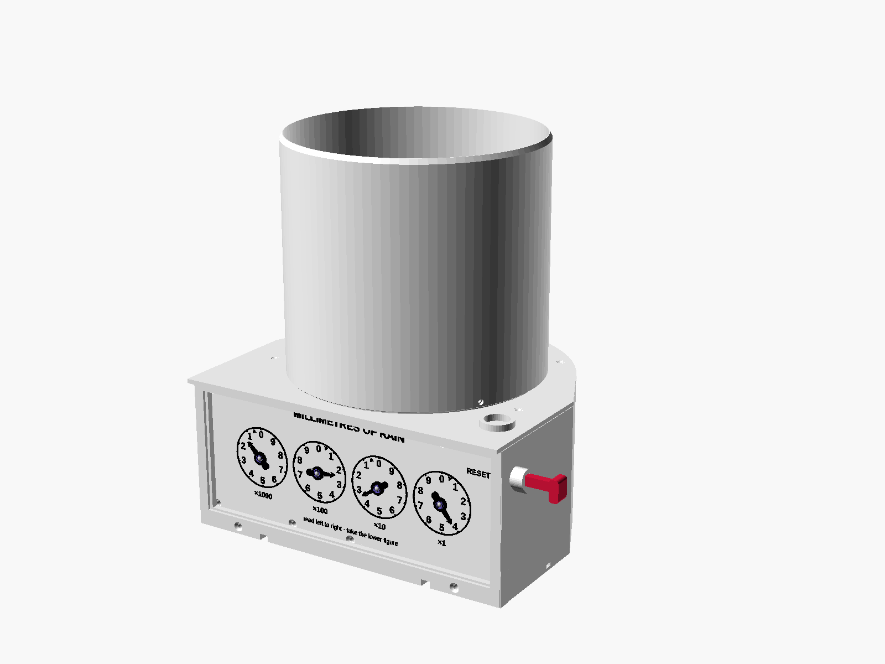
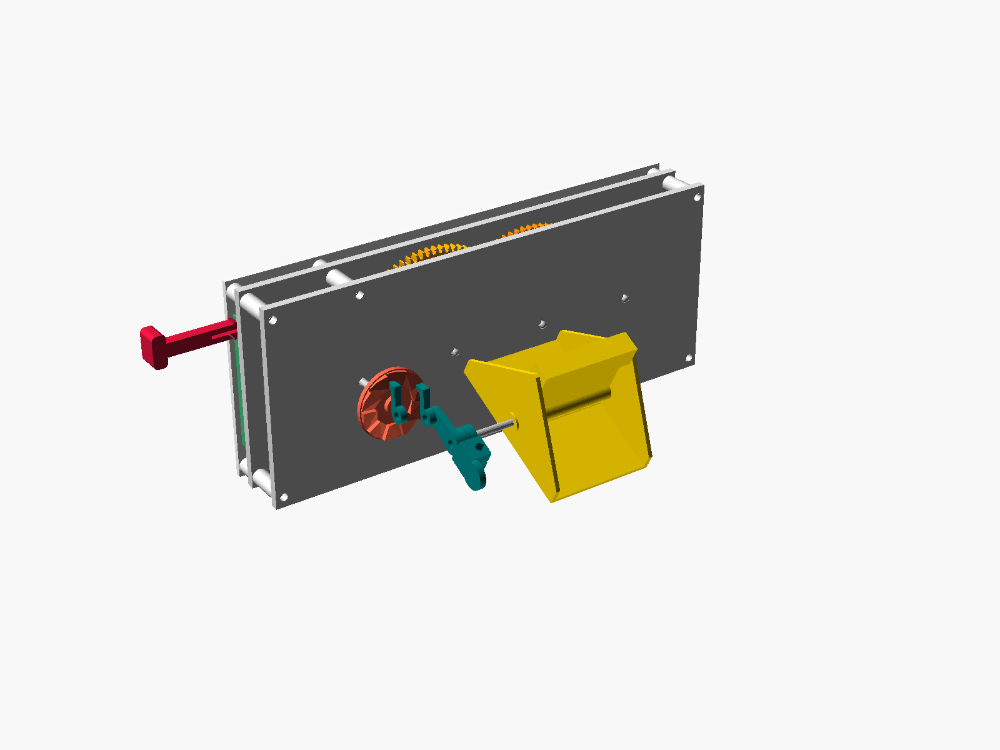
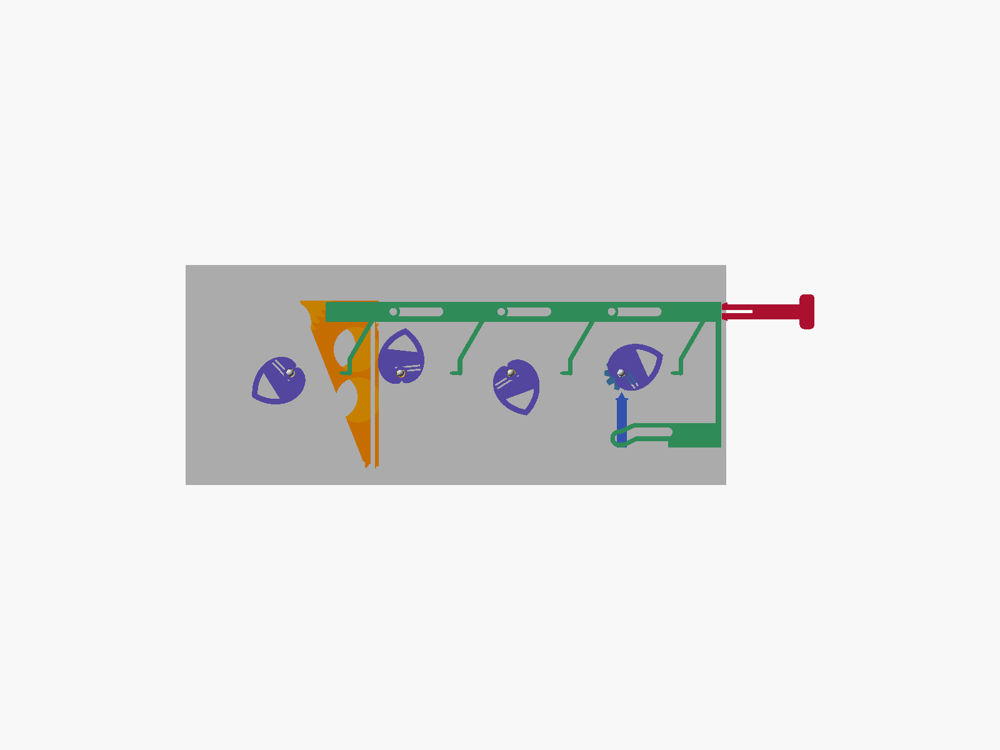
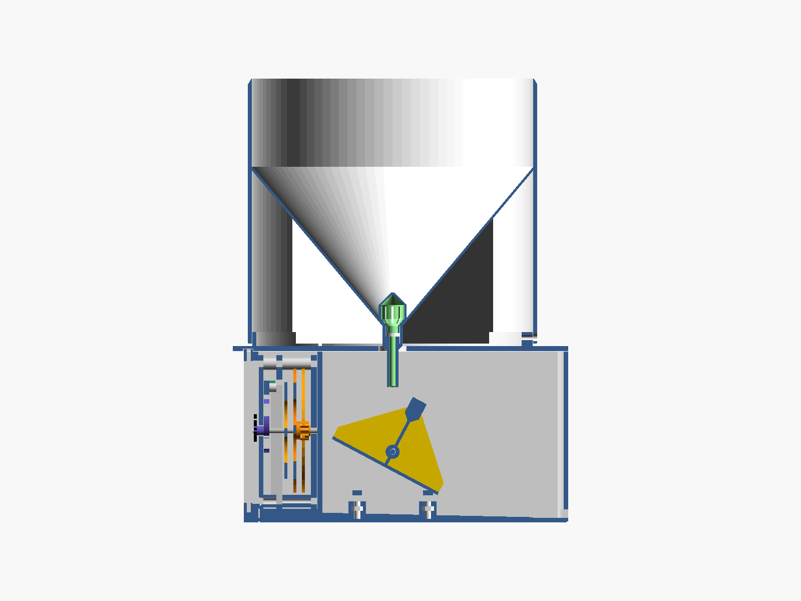

# Mechanical Rain Gauge

A fully mechanical tipping-bucket rain gauge with an old-style **four-dial clock register**,
like an electricity or water meter. It reads **0–9999 mm** of rain on dials marked ×1000, ×100,
×10 and ×1, and a **reset plunger** returns every pointer to zero. There are no electronics,
batteries or magnets.

| | |
|---|---|
| Collector | **Ø159.6 mm = 200 cm²**: the WMO-recommended size and the world's most common national gauge (Hellmann). **1 mm of rain = exactly 20 mL.** |
| Bucket | tips every **10 mL = 0.5 mm**; two stop screws calibrate it |
| Register | 1 count per bucket cycle (2 tips) = **1.0 mm**. The units dial turns once per 10 mm. Dials are geared 10:1 and alternate direction like a power meter |
| Reset | plunger on the right side; heart cams return all four pointers to 0 |
| Size | 222 × 191 × ~252 mm assembled (254 mm wide including the reset button), 29 printed parts in PETG, no supports |
| Printer | Bambu Lab X1C (256³); the largest part (housing) is 230 × 176 mm |
| Hardware | 3 mm stainless rod, a few M3 screws and nuts, optional 2 mm acrylic window |

---

## How it works

1. **Collector.** Rain lands in a sharp-rimmed collector that is vertical inside and bevelled
   outside, per WMO-No. 8. It runs down a **50° funnel** through a leaf screen and a drip nozzle.
   A 50 mm vertical splash wall stops drops bouncing out.
2. **Tipping bucket.** The bucket is a see-saw with a central divider. Its axle is a 3 mm rod that
   **rolls on flat seats** instead of turning in a hole. The bucket rests at 28° on an M3 stop screw
   while the raised compartment fills, and it tips when it holds **10 mL**. The other compartment
   then sits under the nozzle.
3. **Drive.** An arm clamped on the bucket axle carries a **gravity pawl**. Every second tip (one
   full bucket cycle = 20 mL = **1.0 mm**) the pawl pushes a **face ratchet** on the units arbor on
   by one tooth. A gravity **click pawl** at 12 o'clock stops it turning back. The drive is
   crossed-axis: the arbors run front to back, the bucket rocks front to back, and the ratchet's
   teeth are on its rear face. Both pawls pivot on pins parallel to the bucket axle, so they stay
   in plane at every bucket angle. There are no springs in the counting path.
4. **Register.** Four arbors in a row carry single-mesh **8 : 80** gears (module 1, profile
   shifted ±0.55) between neighbouring dials. Each dial turns at a tenth of the speed of the one
   to its right, and in the opposite direction, which is why real meter dials alternate. The dial
   numbering alternates to match.
5. **Reset.** Each pointer, its **heart cam** and its sleeve are friction-gripped on the arbor, so
   only the pointers move during a reset and the gear train is never back-driven. Pressing the
   plunger moves a slide:
   - In the first 5.3 mm of travel a cam track on the slide lifts a **V lock bolt** into a 10-slot
     star on the units arbor. That holds the units arbor on its tooth grid, and it matters: if the
     arbor were left even half a tooth off, every later reading would be offset. The V also pulls
     the arbor back onto the grid if a heart dragged it before the bolt arrived. The track pulls
     the bolt out again on the way back, so there is no lock spring to fight.
   - Four compliant hammer fingers push the hearts round until their notches face the hammers.
     At that point every pointer reads 0.
   - A printed leaf spring returns the slide.
   The pointers can also be turned by hand at any time.

### Reading it

Read like a power meter. Go left to right and take the **lower** figure a pointer has passed.
If a pointer looks exactly on a number, check the dial to its right: if that dial hasn't yet
passed 0, use the number below. The ×1 dial moves in whole-millimetre steps.

---

## What the research settled

| Question | Finding | Sources |
|---|---|---|
| Collector size | WMO-No. 8 (CIMO Guide, Ch. 6): 200–500 cm² "most convenient"; area known to ±0.5 %; rim sharp, vertical inside, bevelled outside; splash lines must strike the wall below the rim. **200 cm² (Hellmann)** is the most common national gauge, ~44 % of ~123 000 gauges (Germany, Russia, India …). Australia/USA use 8" (324 cm²), UK 5" (127 cm²). | [WMO-No. 8](https://community.wmo.int/site/knowledge-hub/programmes-and-initiatives/instruments-and-methods-of-observation-programme-imop/guide-instruments-and-methods-of-observation-wmo-no-8), [Kidd et al. 2017](https://ntrs.nasa.gov/api/citations/20170003703/downloads/20170003703.pdf), [KNMI TR399](https://cdn.knmi.nl/knmi/pdf/bibliotheek/knmipubTR/TR399.pdf) |
| Tip size | WMO asks for ≤ 0.2 mm per tip in electronic gauges. **0.5 mm** is used by JMA gauges, some UK Environment Agency sites and the fully mechanical **Perin R05** recorder (ratchet + heart cam). A mechanical register needs the energy of the bigger tip. | [Tamaya](https://tamaya-technics.com/en/rainfall01/), [Météo-France R05](https://bibliotheque.meteo.fr/pub/INV00000879-pluviographe-simplifie-augets-basculeurs-r05-3025.html) |
| Precedent | Negretti & Zambra sold a **"mechanical dial rain gauge, zero setting, tipping-bucket type"** in 1890, which is this concept. Wren (1662) and Hooke (1670s) built the first tipping-bucket recorders. | [Science Museum](https://collection.sciencemuseumgroup.org.uk/objects/co55130/mechanical-tilting-bucket-rain-gauge-1890), [Biswas 1967](https://royalsocietypublishing.org/doi/10.1098/rsnr.1967.0009) |
| Pivot friction | Commercial buckets use jewels, knife edges or **rolling pins** (Casella, SBS500). Modelled here: a 3 mm pin turning in a hole adds ~11 % to the tip volume; a rolling rod adds ~2 %. | [Casella](https://www.casellasolutions.com/content/dam/casella/ecommerce/documents/datasheets/tipping-bucket/Tipping-Bucket-Rain-Gauge-Datasheet-English.pdf), `analysis/bucket_statics.py` |
| Calibration | Stop screws set the rest angle. Commercial gauges quote ½ turn ≈ 2–3 % (TE525); here 1 turn ≈ 1° ≈ 5 %. Calibrate at a steady low rate, because fast pouring under-reads (water enters during the ~0.5 s tip). | [TE525 manual](https://s.campbellsci.com/documents/us/miscellaneous/old-manuals/TE525,%20TE525WS,%20and%20TE525MM%20Texas%20Electronics%20Rain%20Gages.pdf), [Duchon 2014](https://doi.org/10.1175/JTECH-D-13-00169.1) |
| Dial registers | Meter registers use single-mesh 1:10 stages (Westinghouse used 14 : 140), so neighbouring dials alternate direction, and pointers are friction-fitted. | [US4072267A](https://patents.google.com/patent/US4072267A/en), [US4490672A](https://patents.google.com/patent/US4490672A/en) |
| Reset | The heart cam + hammer is the classic zero-set, and its **dead point** (heart tip facing the hammer) is a documented jam (Kienzle). Cams self-lock when the pressure angle is below the friction angle. Counters unlock or hold the train before zeroing (Hengstler, Veeder-Root). | [US3248051A](https://patents.google.com/patent/US3248051A/en), [US3244368A](https://patents.google.com/patent/US3244368A/en), [US4506373A](https://patents.google.com/patent/US4506373A/en), [US4877169A](https://patents.google.com/patent/US4877169A/en) |
| Rocking → stepping | Impulse counters turn a rocking armature into steps with pawl/anchor star-wheel drives (Sodeco, Hengstler). Bucket-driven registers go back to Baird (1884). | [US3184982A](https://patents.google.com/patent/US3184982A/en), [US295095A](https://patents.google.com/patent/US295095A/en), [US1092082A](https://patents.google.com/patent/US1092082A/en) |
| 3D-printed gauges | The 3D-PAWS ASA gauge tracked a reference at r = 0.98–1.00 on daily totals. PLA absorbed water (BoSL), so use PETG/ASA, 100 % infill for the bucket, and seal it. | [Theisen 2020](https://amt.copernicus.org/articles/13/4699/2020/), [BoSL](https://www.bosl.com.au/wiki/Rain_gauge) |

I found **no patent for a purely mechanical tipping-bucket counter**; every one I checked counted
electrically. The mechanism here combines meter-register, impulse-counter and chronograph practice.

---

## Design analysis (the numbers the model asserts)

**Bucket statics** (`analysis/bucket_statics.py`, reproduced by `tip_volume_ml()` in the .scad):
flat floors 8 mm below the axle, 34 mm compartments, 30 mm divider, 6 g printed ballast, 25 g
empty with the CG 6.7 mm above the axle.

| Rest angle | 22° | 24° | 26° | **28°** | 30° | 32° | 34° |
|---|---|---|---|---|---|---|---|
| Tip volume (mL) | 7.35 | 8.15 | 8.95 | **9.85** | 10.85 | 11.95 | 13.20 |

- **Sensitivity:** ≈ 0.5 mL per degree. The stop screws sit ~28 mm out, so one M3 turn
  (0.5 mm) ≈ 1° ≈ 5 %.
- **Friction:** a rolling axle adds ~0.02 N·mm of friction, which is +2 %. A pin in a hole adds
  0.15 N·mm, which is +11 %.
- **Built-in allowances:** the axle hub displaces ~0.2 mL. Calibration takes both of these out.

**Ratchet drive.**
- The pawl pivot is 14 mm from the axle, so the ±28° swing gives a 13.1 mm stroke. That is
  **1.74 teeth** of a 10-tooth face ratchet at 10.8 mm contact radius.
- After each push, a tooth face sits at the pawl's top position. So a later small back-drag
  (limited to 0.2 tooth by the click) or forward nudge is corrected on the next stroke.
  Asserted: 1.2 ≤ stroke ≤ 1.8 teeth, and stroke − 1 ≥ click backlash + 0.2.
- The first ~⅓ of each swing is idle, so the counter never loads the bucket at the moment it
  starts to tip.

**Gears.** 8 : 80, module 1, 20° pressure angle, profile shift +0.55 / −0.55, so the centre
distance stays 44.0 mm.

| Asserted check | Value |
|---|---|
| Contact ratio | ε = 1.23 (≥ 1.1 still with 0.1 mm centre error) |
| Tip lands | 0.46 mm pinion, 0.59 mm wheel |
| Pinion undercut / interference | none: √(ra²−rb²) = 14.94 < a·sin α = 15.05 |
| Clearance from 80-tooth wheel tips to the next arbor but one | ≥ 1.5 mm |

Backlash comes from thinning the teeth by 0.25 mm on the wheel and 0.05 mm on the pinion. The
centre distance is never opened.

**Heart cams.** Log-spiral hearts, r 3 → 18 mm, with the tip placed 168° from the notch.
- **Notch:** the first 10° either side of the notch is a steep 55° spiral, forming a
  self-centring 70° V. Its growth rate then blends over 6° into the main flanks, so there is no
  corner to snag on.
- **Main flanks:** 28.5° and 25.2°.
- **Hammer path:** each hammer's rounded nose pushes along the notch axis.
- **Dead point:** the tip sits 12° away from every ×1-dial rest position (asserted).

Simulated with `analysis/heart_reset_sim.py` (quasi-static, Coulomb friction, 0.6 mm nose,
start angles every 10°):

| Friction μ | Starts that reset to zero | Zero accuracy |
|---|---|---|
| 0.25 (PTFE-lubricated PETG) | 36 / 36 | ±0.1° |
| 0.35 | 36 / 36 | ±0.1° |
| 0.45 (dry printed PETG, worst case) | 25 / 36 | stalls on the 25° flank |

**PTFE dry lube on the heart edges and hammer noses is therefore required, not optional.**
There is also one designed ~2° dead zone, where the heart tip points straight at the nose: a
flat hammer face would jam over ±17° instead. If a pointer ever sticks, press again or nudge it,
since the pointers are friction-fit.

Fingers clear the neighbouring heart by 1.5 mm at rest and their own zeroed heart by 1.1 mm at
full stroke (asserted).

**Reset mechanism.** Stroke 17.6 mm; the button bottoms on its boss exactly at full stroke, so the
slide's guide slots never take the push.

| Asserted check | Value |
|---|---|
| Lock bolt | V 0.5 mm clear of the star at rest; lifts 2.5 mm (2 mm into a slot) within the first 5.3 mm of travel. The ramp is 27°, well clear of self-locking even with dry PETG (which would lock at ~42°) |
| Timing | the ×1 hammer can first touch its heart at 3.1 mm of travel, when the V is already 0.9 mm into a slot. Earlier drag by the other hearts is taken out by the V, since the slots are indexed to the ratchet's rest positions |
| Bolt retention | its wide rear half runs behind 45°-undercut lips on the rails, so it can't tip forward into the heart plane |
| Cam plate and hanger | pass under / beside the units heart's swept circle with ≥ 1.5 mm at every travel |
| Return leaf | 1.8 × 6.8 mm, loaded 65.5 mm from its root by a rib at the top of the slide bar; free in a window through the front frame that clears its full-stroke shape by 1.5 mm; 0.49 N at rest, 1.7 N and 1.55 % strain at full stroke |
| Push force | ≈ 7 N at the very end (four fingers ≈ 1.3 N each at 1.5 mm overtravel + leaf 1.7 N); less before the noses seat |

**Pawls.** Both pawls stand on their pivots and are held on the ratchet face by gravity. Their CG
leans 20° ahead of the pivot, so a pawl tip could be lifted ~4.8 mm before it flopped backwards;
the ratchet ramps lift it 2.2 mm (asserted with ≥ 1.5 mm margin).

---

## Parts

| Part (`-D part="…"`) | Qty | Orientation (as modelled) | Layer | Notes |
|---|---|---|---|---|
| `collector` | 1 | rim up; skirt and throat on the bed | 0.2 | 3 walls. Measure the rim ID after printing (see calibration) |
| `screen`, `nozzle` | 1 each | spigot / outlet down | 0.12 | |
| `housing_base` | 1 | upright | 0.2 | 228 × 179 mm: place it at the back of the plate, clear of the front-left cutter corner |
| `housing_lid` | 1 | flat, bottom down | 0.2 | |
| `bezel` | 1 | front face down | 0.2 | optional 2 mm acrylic window slides in from the top |
| `bucket` | 1 | upright on its flat floor | 0.2 | **100 % infill** (it must not absorb water); smooth the inside with a dab of epoxy |
| `arm`, `drive_pawl`, `click_pawl` | 1 each | flat | 0.12 | 100 % infill |
| `front_frame`, `back_plate` | 1 each | flat, features up | 0.2 | the return leaf is part of the front frame, free in its window |
| `dial_face` | 1 | numerals up | 0.2 | **Filament change at 2.4 mm** for black numerals on white |
| `slide` | 1 | front face down | 0.12 | 100 % infill; the fingers and cam plate must not have infill voids |
| `lock_bolt` | 1 | rear face down, peg up | 0.12 | 100 % infill |
| `wheel_T`, `wheel_H` | 1 each | wheel face down | 0.12 | |
| `wheel_K`, `pinion_U`, `ratchet_U` | 1 each | flat | 0.12 | |
| `lock_star` | 1 | flat | 0.12 | pressed on during assembly (see step 6) |
| `heart` | **4** | plate down | 0.12 | 100 % infill |
| `pointer` | **4** | face up | 0.12 | black |
| `plunger` | 1 | flat | 0.12 | snaps into the right wall from outside |
| `small_parts` | – | one plate: hearts, pointers, star, ratchet, pinion, bolt, pawls, arm, nozzle, screen, plunger, slide | 0.12 | convenience; 100 % infill |
| `plate_frames` | – | front frame + back plate | 0.2 | convenience |
| `plate_register` | – | the three 80-tooth wheels | 0.12 | convenience |
| `test_coupons` | – | gear-mesh jig + bore gauge | 0.12 | **print these first** |

**Hardware**

| Item | Use |
|---|---|
| 3 mm stainless rod, ~400 mm | bucket axle 80 mm; units arbor 64 mm; three arbors 38 mm |
| M3 × 12 socket cap + 2 nuts each, ×2 | calibration stop screws (captive nut plus jam nut) |
| M3 × 25 countersunk ×7 | dial face → front frame → back-plate posts |
| M3 × 10 ×4 | lid |
| M3 × 10 countersunk ×2 | bezel → sill |
| M3 × 8 ×3 | collector skirt → lid spigot (radial) |
| M3 × 12 + nut | arm clamp (across both ears) |
| M3 × 10 ×2 | drive- and click-pawl pivots (threaded into the arm and post) |
| 15 mm bubble level (optional) | pocket in the lid |
| 2 mm clear acrylic ~212 × 88 mm (optional) | window |
| PTFE dry lube (**required on the hearts and hammer noses**) | hearts, hammer noses, pawls, ratchet face, rolling seats |

---

## Assembly

1. **Test coupons first.**
   - Put the pinion and a wheel on rods in the jig: they should turn freely with a little backlash.
   - Rod fits: the rod must press into bore **P**, turn in **B** and run free in **R**.
2. **Register.**
   - Press the gears onto the arbors (bore 3.22): `pinion_U` and `ratchet_U` on the long units
     rod, and the compounds on the others, with the wheel faces toward the front.
   - Fit the rods through the back-plate posts and the front frame, then screw the frame to the
     posts.
3. **Lock bolt and slide.**
   - Slide `lock_bolt` up into its two rails from below the plate's bottom edge, V up and peg
     facing you: the wide back half goes behind the rail lips, the peg passes between them.
   - Bend the return leaf (in the window left of the ×100 dial) about 12 mm to the left and hold
     it there. Lower the slide onto its three guide pins so the bolt's peg enters the cam track,
     then let the leaf spring back against the left face of the slide's spring tab. The leaf is
     printed straight, so this puts in its 7 mm preload. The slide should now snap back when
     pushed.
4. **Housing.** Slide the movement in from the front until the back plate meets the chamber wall.
   Push the plunger into its square hole in the right wall from outside until the barbs click
   through.
5. **Bucket.**
   - Rest the bucket in the chamber.
   - Push the axle rod through the right-hand window, the bucket hub (press fit) and the left
     window.
   - Clamp the arm on the rod's right end with the pawl pivot pointing forward, and hang the drive
     pawl on its M3 pivot.
   - Fit the click pawl on its post, then the stop screws with captive and jam nuts.
6. **Lock-star phase.** The star's slots must line up with the ratchet's rest positions.
   - Tip the bucket so the drive arm is up.
   - Turn the units arbor backwards until the ratchet rests on the drive pawl.
   - Push the reset button fully in and hold it, so the bolt is up.
   - Press `lock_star` onto the front of the units arbor so the bolt's V sits in a slot. Add a
     drop of CA glue.
7. **Hearts and pointers.** Slide a heart onto each arbor front (the grip finger should need a
   firm push) and press a pointer onto each D-sleeve. PTFE-lube the heart edges and hammer noses.
8. **Dial face and bezel.** Fit the dial face with the seven countersunk M3 × 25 screws, slide in
   the window if you're using one, then screw on the bezel. Its inner lip presses the dial face
   and pushes the whole movement back against the chamber wall.
9. **Lid, nozzle and collector.** Screw on the lid. Press the nozzle into the collector's throat
   from below and drop the leaf screen in from above. Lower the collector over the lid's spigot
   (the nozzle passes down through the lid hole and the ribs sit on the spigot top), then fit the
   three radial screws.

## Calibration

1. **Level the gauge.** Tilt shifts each tip by ~5 % per degree, although counting the pair of
   tips cancels most of it.
2. **Work out the test volume.** Measure the rim's inside diameter D in mm at three places and
   average. 10 mm of rain = π/4 × D² × 10 / 1000 mL, which is 200 mL for D = 159.6.
3. **Pour it.** Pour **400 mL (20 mm)** slowly, over at least 20 minutes (a drip bottle or IV
   bag). Fast pouring under-reads.
4. **Check the reading.** It should read **20**. Each count is one bucket cycle. You can also
   watch single tips: 20 mL per pair.
5. **Adjust.** If it reads high, the bucket tips too early: screw **both** stops **down** equally.
   If it reads low, screw them up. One turn ≈ 5 %. Tighten the jam nuts.
6. **Reset** with the plunger.

## Siting and care

- **Height and exposure:** mount it on a post with the rim level and 0.3–1 m above short grass.
  Keep it at least twice an obstacle's height away from that obstacle, and keep it off roofs and
  paving (splash).
- **Cleaning:** clean the leaf screen and nozzle regularly, and flush the bucket occasionally.
- **UV:** PETG loses ~20–30 % of its strength over 1–2 years in full sun. Use white filament, and
  reprint the collector and bucket when they chalk.

---

## Verification (OpenSCAD nightly 2026.09.23, Manifold)

- **Build gate:** all 28 `part=` values compile with `--hardwarnings`, exit 0, with non-empty STLs
  and clean stderr.
- **Slicer manifold:** every STL passes the edge-manifold check (0 non-manifold edges), and every
  single part exports as **one connected piece** (this check caught the first draft's wheels,
  whose lightening windows had cut the rim free).
- **Contracts:** asserts pass for orifice area, tip volume, ratchet quantisation, gear geometry and
  wheel spokes, heart flank angles and dead point, finger clearances, lock-bolt timing and
  clearances, return-leaf force and strain, plunger fit, pawl over-centre margin, and bed fit.
- **Clash checks** (intersection volumes of the placed parts):
  - the bucket, arm and pawls clear the housing and movement at −28°, 0° and +28°;
  - the slide, lock bolt, star, plunger, front frame and dial face clear each other at rest,
    mid-ramp and full stroke, and the cam plate and hanger clear every heart's swept circle;
  - the three gear meshes are interference-free at their assembly phases;
  - the collector clears the lid (its ribs just touch the spigot top).
  The only overlaps are intended: pawl teeth resting on ratchet ramps, and the bezel lip's
  0.5 mm preload on the dial face.
- **Return leaf:** its bent shape (loaded at the tab height) clears the window edge, the slide's
  guide-pin shoulders and the tab itself from rest to full stroke plus the slot's spare travel.
- **Bambu projects:** every `bambu/*.3mf` re-imports through lib3mf with the same size and volume
  as the model.

**Residuals that need a test print:**
- the grip finger's pointer torque (target 0.3–0.5 N·mm)
- how the gear mesh feels
- the real tip volume and its repeatability
- reset reliability, and how much the return leaf creeps over time (re-bend it if the slide
  stops returning fully)
- whether the drive pawl drops cleanly at speed
- the bolt's slide in its rails and the plunger barbs' hold

The `test_coupons` part and the calibration procedure cover the first three.

## Files

- `rain_gauge.scad`: the single parametric model; every part is in print orientation.
- `analysis/bucket_statics.py`, `analysis/heart_reset_sim.py`: the design calculations.
- `stl/`: one STL per part (ASCII; the plates are in the Bambu projects).
- `bambu/`: Bambu Studio project files (X1C, PETG HF, settings baked in) for each plate: the
  housing base, lid, collector, bezel, bucket, dial face, frames, register wheels and small parts.
  Add the dial face's filament change at 2.4 mm in Bambu Studio.
- `preview-*.png`: renders.

## Design history

| Version | AI model | Date | Change |
|---|---|---|---|
| v1 | claude-opus-5-5 | 2026-09-28 | Initial design: 200 cm² collector, 0.5 mm tipping bucket, face-ratchet drive, 4-dial 8:80 register, heart-cam reset with cam-driven lock bolt; two design-review rounds |
