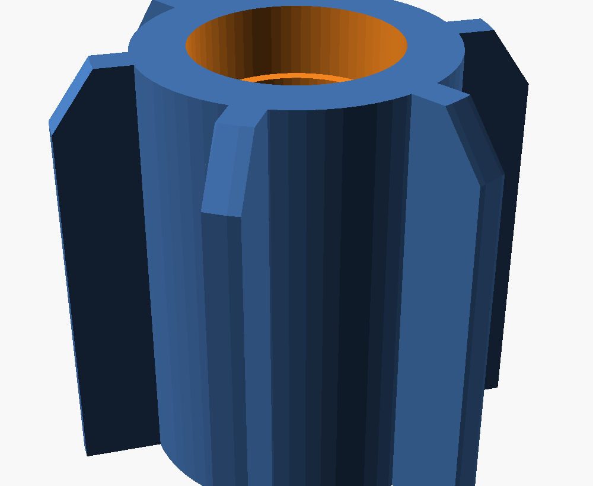
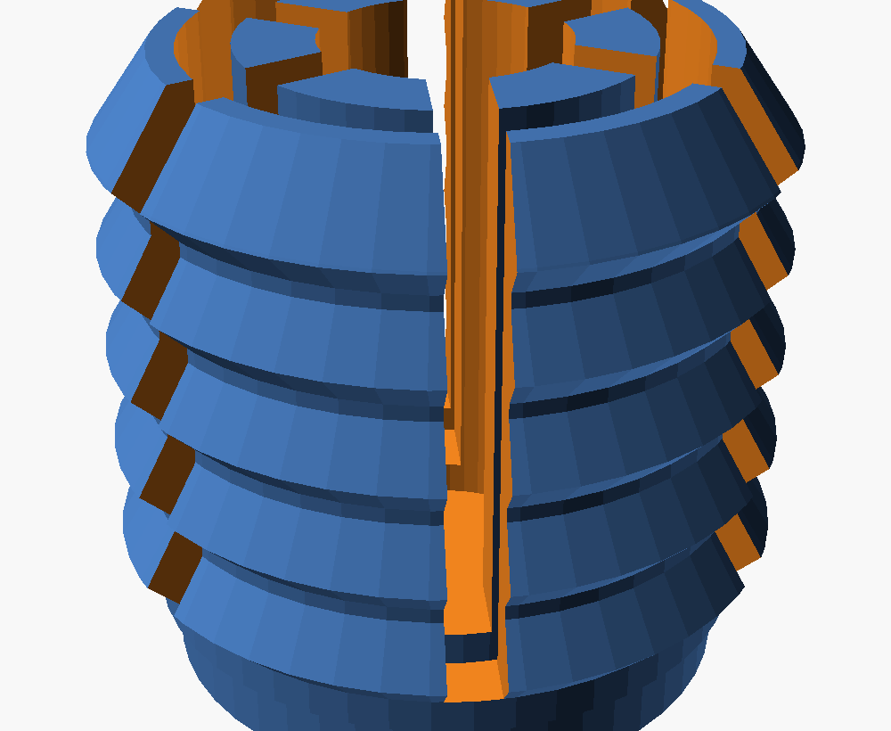

# Caster Tube Insert

Mounts an **M8 threaded-stem caster wheel** into the open end of a round **steel tube** (~18 mm ID, ±1 mm, 21 mm deep). Three iterations — **use v3**:

- **v3 — simple solid push-in (RECOMMENDED).** One solid printed piece. The caster **self-taps a Ø7.5 hole** in a solid hub (steel screw forms its own thread — nothing fine to misprint), and **tangential "pinwheel" fins** grip the tube by bending *sideways* (in the layer plane), so they don't snap like v2's did. Files: `caster-tube-insert-v3.scad`, `caster-plug-v3.stl`. See [v3 below](#v3--simple-solid-push-in-recommended).
- **v2 — barbed push-in (superseded).** Self-tap hole was too small (Ø7.0, seized) and the thin cantilever fins flexed *across* the layers and snapped off on insertion.
- **v1 — expanding collet (superseded).** The small printed M8 thread in the cone-nut wouldn't form, and gripping it to drive the screw broke the teeth.

---

## v3 — simple solid push-in (RECOMMENDED)

One solid piece. Why it fixes the earlier failures:

- **M8 = self-tap at Ø7.5 (not Ø7.0).** The steel screw forms its own thread in PETG — a *plain hole can't misprint*. v2's Ø7.0 meant ~90% thread → it seized; **Ø7.5 is ~50% thread**: holds a caster, drives with far less force. A clearance counterbore at the mouth means the screw only forms thread over the deeper ~10 mm (less torque).
- **Fins bend *in-plane*.** The whole plug is one cross-section extruded straight up, so the grip fins lean **tangentially** — when the tube squeezes them they bend sideways along the print layers (full strength), instead of bending across the layers (which delaminated and snapped v2).

### Install (important — do the pre-tap)
1. **Pre-form the thread:** wind a plain **M8 bolt** all the way into the hub once with a spanner (easy leverage on the bench), then back it out. This forms the thread so the caster then goes in by hand.
2. **Fit the caster:** thread the caster stem into the now-formed thread.
3. **Tap it home:** push/tap the assembly into the tube with a soft mallet until the caster plate seats on the rim. Hold the solid hub, never the fins.

### Printing (v3)
- **Material:** PETG. **Layer height:** 0.2 mm is fine (no printed thread). **Infill:** 50–100% (the hub takes the thread). **Supports:** none — straight vertical extrusion.
- **Orientation:** as exported — the counterbore (open/caster) end down on the plate.

### Tuning (v3) — you can dial this to your actual tubes
| Want | Change (in `caster-tube-insert-v3.scad`) |
|------|-------------------------------------------|
| Too hard to push in | lower `crest_d` (e.g. 19.0) or `fin_thick` (1.2) |
| Too loose / pulls out | raise `crest_d`, more `n_fin`, or thicker `fin_thick` |
| M8 too hard to drive | raise `selftap_d` (7.5 → 7.7) |
| M8 strips / won't hold | lower `selftap_d` (7.5 → 7.2) |
| Different stem (M6/M10) | `selftap_d` (M6 ≈ 5.0, M10 ≈ 9.3) |

---

## v2 — push-in, self-tapping (superseded)

One-piece plug: a **solid central core** the caster's M8 stem **self-taps** into (a steel M8 cuts its own thread in PETG — no fragile printed thread, and a captured nut can't fit a 17 mm tube), surrounded by **flexible barbed fingers** that compress to enter a tight tube and spring out to grip a loose one.

### Why this replaces v1
- A steel M8 nut is ~15 mm across corners + walls > 17 mm tube → can't be captured.
- A printed internal M8 thread is too fine to form reliably at this size (v1's failure).
- Self-tapping into a solid core is reliable and strong; the core won't split like the hollow cone-nut.
- Push-in (not screw-in-place) means nothing delicate to grip during install.

### Install
1. **Pre-tap the core:** wind a plain M8 bolt all the way into the core once (easy with a spanner on the bench), then back it out. This forms the thread so the caster goes in easily afterwards.
2. **Fit the caster:** thread the caster stem into the now-tapped core until its top plate meets the head.
3. **Tap it home:** push/tap the whole assembly into the tube with a soft mallet until the caster plate seats on the tube rim. Hold the solid **head/core**, never the fingers.

To remove: pull/lever the plug out (the barbs release under steady force).

### Printing (v2)
- **Material:** PETG. **Layer height:** 0.2 mm is fine (no fine threads). **Infill:** 60–100% (the core takes the thread). **Supports:** none.
- **Orientation:** as exported — the flat **head disc is the base** (stable, no brim).

### Tuning (v2)
| Want | Change (in `caster-tube-insert-v2.scad`) |
|------|-------------------------------------------|
| Too hard to push in | lower `relaxed_crest_d` (e.g. 19.0) or thin `seg_wall` |
| Too loose / pulls out | raise `relaxed_crest_d`, or more barb rings (`barb_pitch`) |
| Caster strips / won't hold | lower `selftap_d` (7.0 → 6.8) |
| Too hard to drive the screw | raise `selftap_d` (7.0 → 7.3) |
| Different stem (M6/M10) | `m8_d`, `selftap_d` (M6 ≈ 5.2, M10 ≈ 8.7) |

---

## v1 — expanding collet (superseded)

A two-part plug that grips the tube with a screw-tightened expanding collet.

### How it works

It's a **self-energising expanding collet** — the same principle as commercial "expanding stem" caster adapters, adapted for FDM:

- **Collet** (Part A) — a slotted sleeve with 4 spring fingers and external grip ridges. Relaxed, it slides into the tube; an internal cone is its wedge ramp.
- **Cone-nut** (Part B) — a tapered nut carrying the M8 thread for the caster. Anti-rotation fins key it into the collet's slots so it can't spin.
- Screwing the caster's M8 stem into the cone-nut **draws the cone-nut toward the caster**, wedging the fingers outward against the tube wall.
- Because steel is harder than PETG, the ridges don't bite — grip is the wedge's high normal force × friction. The ~9° wedge is below the ~17° plastic-on-steel friction angle, so it is **self-locking and self-energising**: more pull-out load → the cone is pulled deeper → it grips *harder*.

The caster's own top plate carries the standing weight onto the tube rim; the insert's job is to resist **pull-out** and stop the caster wobbling.

## Fit (designed targets)

| Spec | Value |
|------|-------|
| Tube ID | 18 mm nominal, covers 17–19 mm |
| Insert length | 20 mm (fits the 21 mm depth limit) |
| Caster thread | M8 × 1.25, ~5 mm engagement at rest, growing to ~8.6 mm as it tightens |
| Relaxed ridge crest | 17.0 mm (slips into the tightest tube; fingers flex ~0.2 mm for a hair under) |
| Wedge | ~10° half-angle, up to ~2 mm diameter expansion → grips to ~19 mm |

## Install

1. **Pre-assemble:** drop the cone-nut into the collet from the deep (finger-tip) end, fins aligned to the slots, until it seats. (The cone-nut can't be added once the collet is in the tube, so do this first — hold the cone-nut in place if the assembly is inverted.)
2. **Insert the unit** fingers-first into the tube. With the cone-nut at rest the crest is ~17 mm, so it slides into a 17–19 mm tube (a hair of finger flex for the very tightest).
3. **Screw the caster** stem into the cone-nut and tighten firmly. The last turns draw the cone-nut down and wedge the collet hard into the tube wall, and the M8 thread locks it there. Done — no separate tools.

To remove: unscrew the caster; the wedge releases and the unit pulls out.

## Files

- `caster-tube-insert.scad` — parametric source (edit this)
- `collet.stl`, `cone-nut.stl` — ready-to-slice parts
- `preview-layout.png`, `preview-assembled.png` — renders

In the `.scad`, set `part` to `"all"`, `"collet"`, `"cone"`, or `"assembled"` (cutaway fit check).

## Printing

- **Material:** PETG (ductile — the fingers flex to grip without cracking)
- **Layer height:** collet 0.2 mm is fine; **print the cone-nut fine (0.08–0.16 mm)** — an internal M8 thread is marginal at 0.2 mm (0.08 mm is ideal, ~15 layers per thread turn). On such a small part, keep the slicer's min-layer-time/cooling on so fine thread crests don't blob from heat.
- **Walls:** 4 perimeters min; **infill:** 40–60% gyroid (small part)
- **Supports:** none — both parts are self-supporting as oriented.
- **Orientation:** as exported, Z=0 on the bed. The collet stands on its collar. The **cone-nut prints cap-down** (wide flat base — stable, no brim needed); its M8 thread entry is at the top. In use the narrow end faces the caster, so flip the printed cone-nut when assembling.
- After printing, run an M8 bolt (or the caster) through the cone-nut once to seat the thread. **If the M8 won't start**, the printed thread didn't form — set `printed_thread = false` (default `insert_bore_d = 7.2`) and reprint the cone-nut, then drive the M8 straight in to self-tap its own thread.

## Tuning (common tweaks)

| Want | Change (in the `.scad`) |
|------|--------------------------|
| Won't push into the tube | lower `relaxed_crest_d` (e.g. 16.8) |
| Too loose / won't grip biggest tube | raise `relaxed_crest_d`, or scale print 100.5% |
| Different stem (M6/M10) | `m8_d`, `m8_pitch`, `m8_minor`, `stem_clear_d` |
| Heat-set insert instead of printed thread | `printed_thread=false`, set `insert_bore_d` |
| More grip travel vs. more thread engagement | `wedge_z0` (higher = more travel) |
