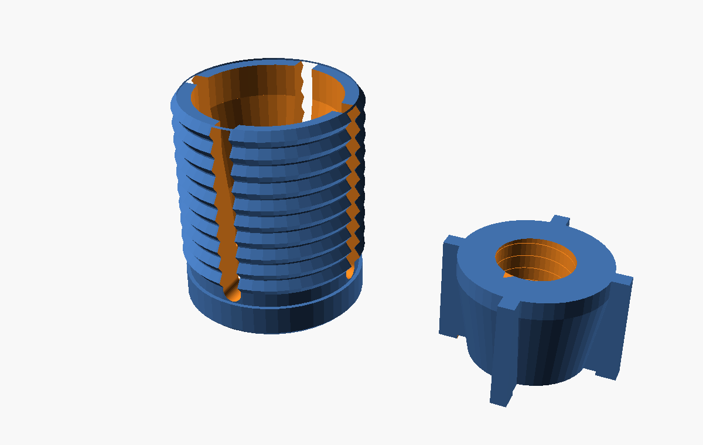
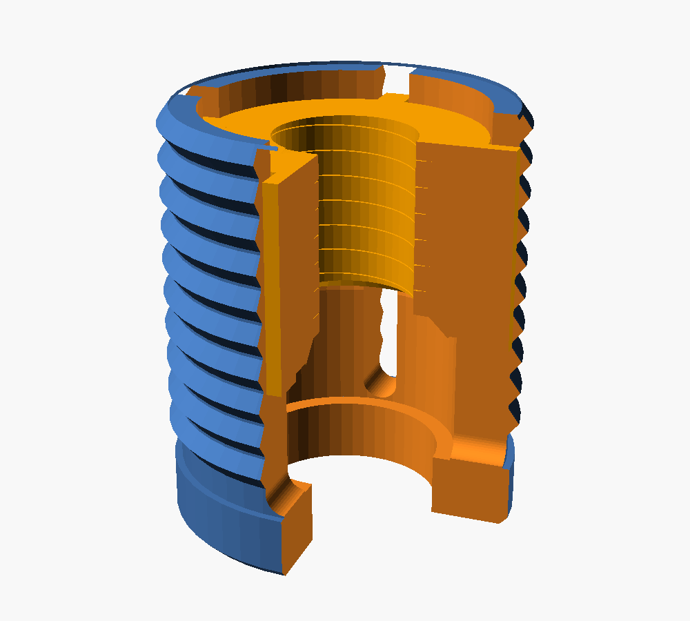

# Caster Tube Insert (Expanding Collet)

A two-part plug that mounts an **M8 threaded-stem caster wheel** into the open end of a round **steel tube** (~18 mm ID, ±1 mm) with strong, adjustable retention.

## How it works

It's a **self-energising expanding collet** — the same principle as commercial "expanding stem" caster adapters, adapted for FDM:

- **Collet** (Part A) — a slotted sleeve with 4 spring fingers and external grip ridges. Relaxed, it slides into the tube; an internal cone is its wedge ramp.
- **Cone-nut** (Part B) — a tapered nut carrying the M8 thread for the caster. Anti-rotation fins key it into the collet's slots so it can't spin.
- Screwing the caster's M8 stem into the cone-nut **draws the cone-nut toward the caster**, wedging the fingers outward against the tube wall.
- Because steel is harder than PETG, the ridges don't bite — grip is the wedge's high normal force × friction. The ~9° wedge is below the ~17° plastic-on-steel friction angle, so it is **self-locking and self-energising**: more pull-out load → the cone is pulled deeper → it grips *harder*.

The caster's own top plate carries the standing weight onto the tube rim; the insert's job is to resist **pull-out** and stop the caster wobbling.

## Fit (designed targets)

| Spec | Value |
|------|-------|
| Tube ID | 18 mm nominal, covers 17–19 mm |
| Insert length | 20 mm (fits the 21 mm depth limit) |
| Caster thread | M8 × 1.25, ~5 mm engagement at rest, growing to ~8.6 mm as it tightens |
| Relaxed ridge crest | 17.0 mm (slips into the tightest tube; fingers flex ~0.2 mm for a hair under) |
| Wedge | ~10° half-angle, up to ~2 mm diameter expansion → grips to ~19 mm |

## Install

1. **Pre-assemble:** drop the cone-nut into the collet from the deep (finger-tip) end, fins aligned to the slots, until it seats. (The cone-nut can't be added once the collet is in the tube, so do this first — hold the cone-nut in place if the assembly is inverted.)
2. **Insert the unit** fingers-first into the tube. With the cone-nut at rest the crest is ~17 mm, so it slides into a 17–19 mm tube (a hair of finger flex for the very tightest).
3. **Screw the caster** stem into the cone-nut and tighten firmly. The last turns draw the cone-nut down and wedge the collet hard into the tube wall, and the M8 thread locks it there. Done — no separate tools.

To remove: unscrew the caster; the wedge releases and the unit pulls out.

## Files

- `caster-tube-insert.scad` — parametric source (edit this)
- `collet.stl`, `cone-nut.stl` — ready-to-slice parts
- `preview-layout.png`, `preview-assembled.png` — renders

In the `.scad`, set `part` to `"all"`, `"collet"`, `"cone"`, or `"assembled"` (cutaway fit check).

## Printing

- **Material:** PETG (ductile — the fingers flex to grip without cracking)
- **Layer height:** 0.2 mm (0.16 mm gives crisper threads)
- **Walls:** 4 perimeters min; **infill:** 40–60% gyroid (small part)
- **Supports:** none — internal cone widens upward, slots are vertical
- **Orientation:** as exported, Z=0 on the bed. The collet stands on its collar (wide, stable); the **cone-nut stands on its narrow end — a 5–8 mm brim is required** or it can detach mid-print.
- After printing, run an M8 bolt (or the caster) through the cone-nut once to seat the thread.

## Tuning (common tweaks)

| Want | Change (in the `.scad`) |
|------|--------------------------|
| Won't push into the tube | lower `relaxed_crest_d` (e.g. 16.8) |
| Too loose / won't grip biggest tube | raise `relaxed_crest_d`, or scale print 100.5% |
| Different stem (M6/M10) | `m8_d`, `m8_pitch`, `m8_minor`, `stem_clear_d` |
| Heat-set insert instead of printed thread | `printed_thread=false`, set `insert_bore_d` |
| More grip travel vs. more thread engagement | `wedge_z0` (higher = more travel) |
