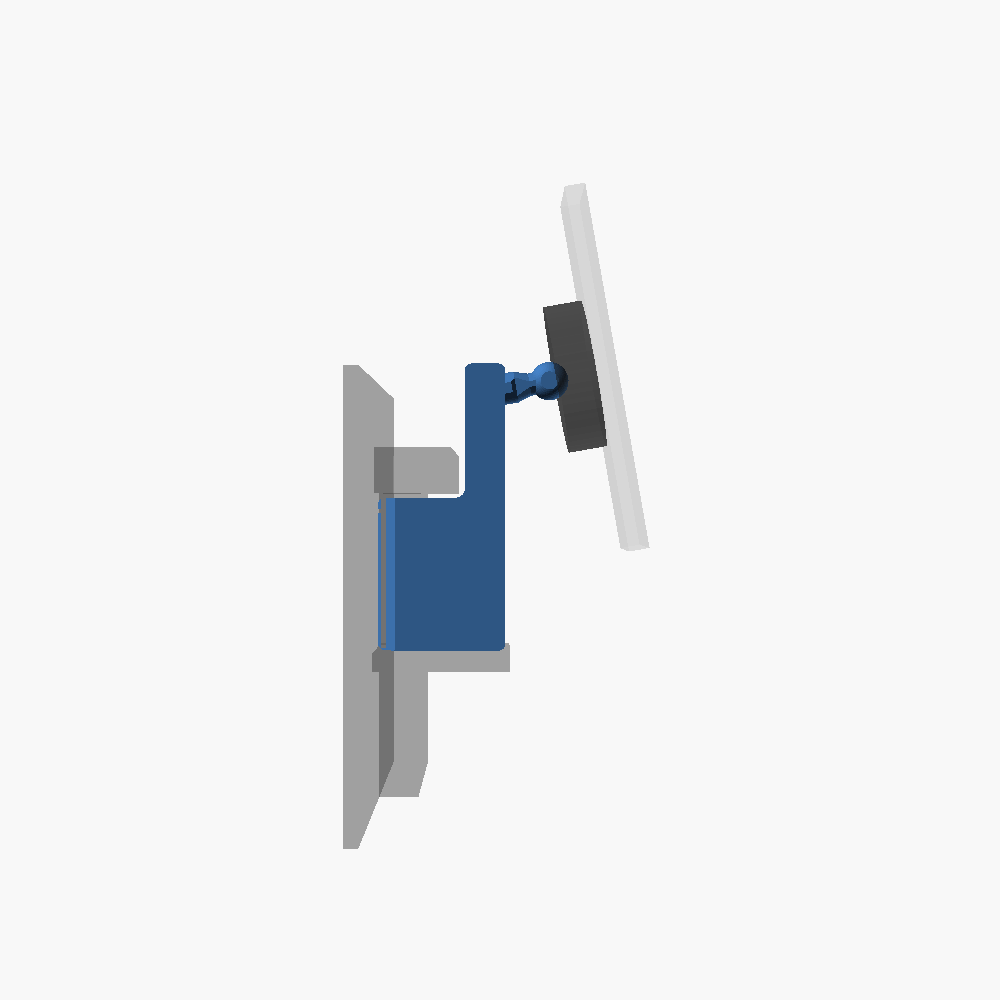
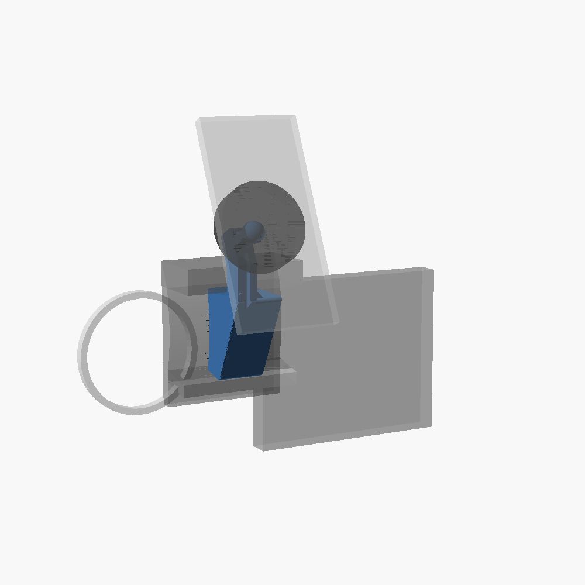
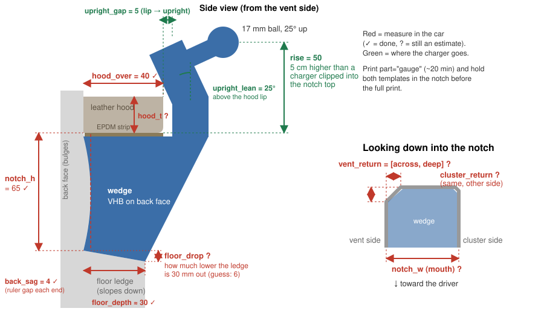
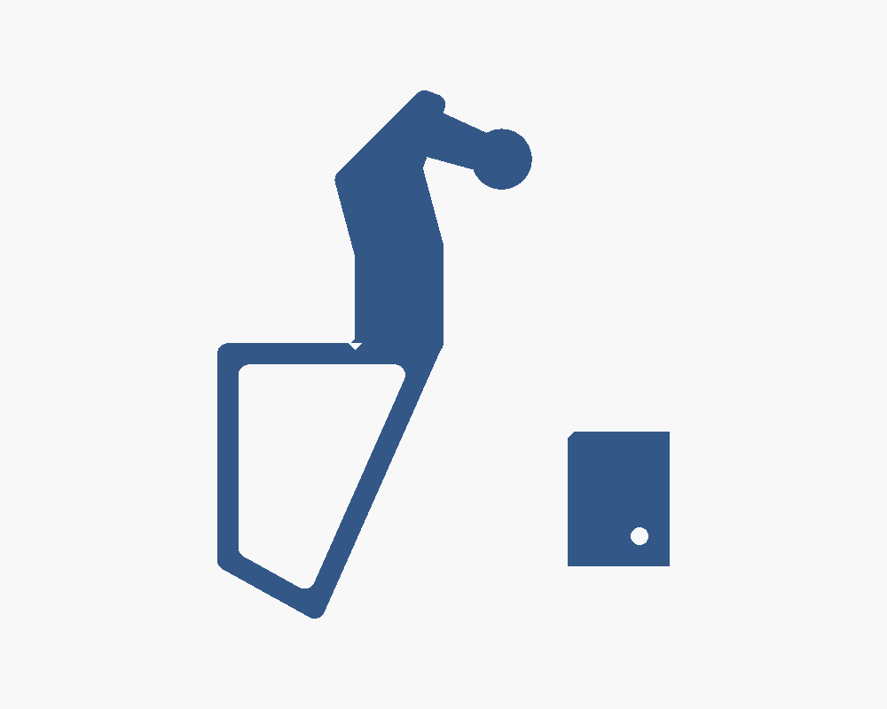
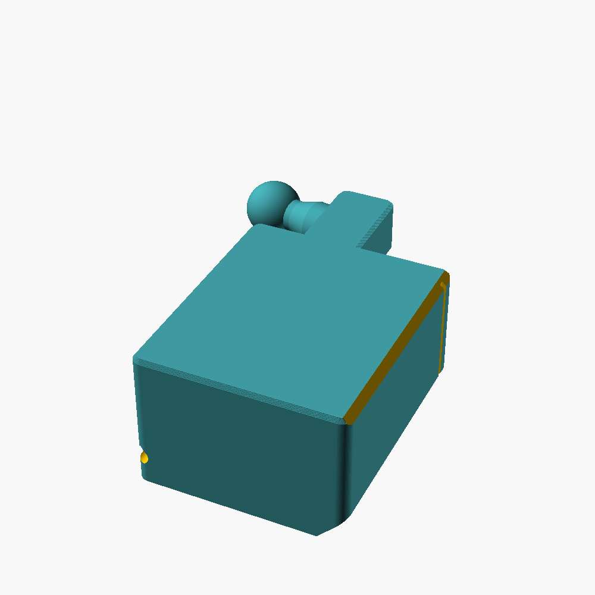

# Land Rover Discovery 4 Phone Mount

A one-piece bracket that plugs into the recessed notch on the dash just left of the
instrument binnacle (right-hand-drive 2013 Discovery 4, Australian market), under the
leather hood, and carries a **LISEN W116 Qi2.2 25 W** magnetic wireless charger on a
standard **17 mm ball**. It holds the phone **4 cm out from the notch and 5 cm up**, and
is built for corrugations and four-wheel driving, not just bitumen.

- One piece, **ASA**, ~77 g, no supports, no holes in the trim.
- A wedge fills the notch. Its sloped bottom sits on the whole ledge, its front face
  climbs to 65 mm out at the top, an EPDM strip on top presses up into the underside of
  the hood, and two small patches of 3M VHB hold its back face.
- An upright rises in front of the hood lip. At the top, a short tapered neck ends in a
  printed 17 mm ball, and the W116 head clamps straight onto it. No vent clip in
  between to rattle.
- Snap-in groove down the front of the upright for the USB-C lead.
- A rip-cord groove across the back means it comes off again without damage.
- Strength is checked by the model itself (see [Off-road strength](#off-road-strength)).

## Before you print: measure

`notch_h`, `hood_over` and the ledge depth are **measured**. The rest are still
**estimates from photos**. Measure these and put them at the top of
`d4-phone-mount-v1.scad`, or send them to Claude and it'll re-export:

| Parameter | What it is | Default |
|---|---|---|
| `notch_h` | Floor ledge up to the underside of the leather hood, measured at the back of the notch | **65 mm** (measured) |
| `hood_over` | How far the hood's front lip sticks out past the notch's back face | **40 mm** (measured) |
| `floor_depth` | How far the ledge runs out from the back face | **30 mm** (measured, approx) |
| `floor_drop` | How much lower the ledge is 30 mm out than where it meets the back face (it slopes down) | 6 mm, **estimate** |
| `notch_w` | Width across the mouth of the notch | 40 mm |
| `vent_return` | Vent-side wall: `[how far it steps in by the back face, how deep that angled part runs]` | `[8, 8]` |
| `cluster_return` | Cluster-side wall, same meaning (`[0, 0]` = square corner) | `[2, 2]` |
| `hood_t` | Thickness of the hood's lip, underside to top of the leather (used for reporting only) | 20 mm |

Where you want the charger (already set to what you asked for):

| Parameter | What it is | Default |
|---|---|---|
| `upright_offset` | Notch back face → dash side of the upright, 5 mm clear of the hood lip | 45 mm |
| `block_bottom_d` | How much of the ledge the wedge's bottom sits on (see [why not 10 mm](#why-the-bottom-uses-the-whole-ledge)) | 30 mm (all of it) |
| `rise` | Top of the notch (hood underside) → centre of the ball: how much higher than a charger clipped straight into the notch ("5 cm up") | 50 mm |
| `ball_pitch` | Neck tilted up, a head start on aiming at your eyes (the ball joint does the rest) | 10° |
| `beam_side` | Which side of the notch the upright rides on, seen from the driver's seat | `"left"` (vent side, clear of the gauges) |

> **What "5 cm up" means here:** clipped straight into the notch, the charger's ball
> would sit about level with the top of the notch (where the clip hooks in, right under
> the hood). The bracket lifts it **50 mm above that**, and the ball sits about 85 mm out
> from the notch so the charger clears your 40 mm hood lip. That leaves the ball about 30 mm above the top of the leather
> (with `hood_t = 20`). The side template shows exactly where the ball will be before
> you commit. Nudge `rise` if you want it higher or lower.

**Measuring `floor_drop`:** lay a ruler flat across the top of the ledge from the back
face, level it, and measure how far the ledge has dropped below it 30 mm out. If in
doubt, guess 1 mm too much rather than too little: the wedge then lands on the ledge's
front edge (the good spot) and the EPDM takes up the difference.

### Test prints first (about 20 minutes)

1. **`part="gauge"`**: two 2.4 mm templates on one plate.
   - *Side template*: stand it in the notch, back edge on the back face and the sloped
     bottom edge on the ledge. The bottom should sit flat on the ledge, not rock on its
     back corner; if it rocks, `floor_drop` is off. The top edge should sit about 2 mm under
     the hood, which is the EPDM gap. The little V on the top edge should line up with the hood's front lip, and the
     upright should clear the lip. The disc shows where the ball, and so the charger,
     will be.
   - *Plan template*: slide it in flat at mid height. It should reach the back face
     without binding on the angled sides. The hole marks the vent side.
2. **`part="ball_test"`**: a small block with the neck and ball, printed exactly like
   the real one. Check the W116's socket clamps it firmly. If it's too tight or loose,
   change `asa_shrink` (1.004 looser … 1.008 tighter) and re-export.

**Check the ball-joint collar comes off your vent clip.** The W116 head is held on its
vent clip by a threaded collar around the ball. Unscrew it and make sure the collar
slides off over the clip's ball. On some mounts the collar is trapped on the old
stalk. If yours is, tell Claude. The fallback is a version with a fake vent slat for the
stock steel hook clip to grab.

## Fitting

1. **Dry-fit first.** Push the bracket in with the EPDM strip on and no tape, and check
   it seats against the back face and feels wedged.
2. Stick a strip of **closed-cell EPDM foam tape**, about 3 mm (compresses to 2), on the
   block's top face, the part that goes under the hood. Use EPDM rather than felt:
   felt takes a set and the wedge goes loose.
3. Lay a length of **braided fishing line** in the groove across the back face. Tuck
   its ends down the two sides of the block, where they'll sit in the gaps beside the
   notch walls. This is the rip cord.
4. Clean the notch's back face with isopropyl alcohol. Car trim is often
   low-surface-energy plastic, so a wipe of **3M adhesion promoter (94 or 4298UV)**
   makes VHB grip far better.
5. Put **two patches of 3M VHB 5952** (black, 1.1 mm), about 20 × 25 mm each, on the
   back face below the rip-cord groove: one high, one low. That's plenty. The notch
   takes the load, and the tape only stops the block sliding out.
6. Slide the block straight in, EPDM first under the hood lip, until the tape meets the
   back face, then press hard for 30 s. Leave it 24 h before hanging the charger on it.
7. Unscrew the W116 head's collar, pop the head onto the printed ball, tighten the
   collar and aim it. It'll want to yaw right, toward you. The neck is kept round on
   that side, so nothing fouls the collar.
8. Clip the USB-C lead into the groove down the front of the upright.

**Removing it:** pull the two rip-cord ends down and forward with a sawing motion. The
line cuts through both tape patches. If the line has gone, warm the block with a hair
dryer (VHB softens) and ease it straight out. Adhesive remover takes off any residue.

## Why it's shaped like this

**The notch does the holding; the tape stops it walking.** The phone sits out on a lever,
so it's always trying to tip the wedge forward. The tipping pivot is the front edge of
the wedge's bottom, where it sits on the ledge. Behind that edge, the top of the wedge
pushes up into the hood, where it's already wedged by the EPDM. The tape on the back
face is loaded in *shear*, VHB's strongest direction. Nothing asks the tape to hold the
phone's weight in peel.

### Why the bottom uses the whole ledge

Only the part of the hood contact **behind** the pivot pushes back, so the deeper the
bottom sits on the ledge, the longer that lever and the less the EPDM gets squashed. The
model works this out and asserts it:

| Wedge bottom on the ledge | Push on the EPDM in a 4 g bump | Pressure on the EPDM |
|---|---|---|
| **30 mm (the whole ledge, default)** | **97 N** (24 N sitting still) | **0.09 MPa**, fine |
| 10 mm | 394 N (99 N sitting still) | 1.17 MPa: crushes the foam, so it rocks |

So the bottom follows your ledge's slope all the way out. It's still a wedge, just
30 mm at the bottom rather than 10. The plastic itself would be fine either way; it's
the grip on the car that changes. A flat bottom on a sloping ledge would be worst of
all: it touches only at its back corner, and the tape ends up doing all the work.

**Printed lying on its side.** The flat side of the upright goes on the plate, so the
whole side profile prints flat. The phone's weight and every bump bend the block,
upright, neck and ball in the plane of the layers. Nothing is loaded across a layer
line, which is where FDM parts break.

**Integral ball, not a vent clip.** The shortest, stiffest path from dash to charger,
and nothing with jaws to vibrate loose on corrugations.

**The neck tapers, and it's round where it matters.** It starts Ø14 at the upright and
tapers gently to Ø10 only for the last few mm, where the socket needs room to swing.
There's no sharp shoulder at the most-stressed point, which matters for vibration
fatigue. Printing a ball on its side needs something under it, so:

- The root runs down to the plate with 45° sides.
- The rest is cut flat underneath and prints as a ~9 mm bridge.
- The ball gets an 8 mm flat where it touches the plate.

All of that is on the vent side. When you swing the charger right toward yourself, the
collar closes on the neck's *right* side, which is kept round, so you keep the full
range of the ball joint.

**One thing to know:** with the phone square to the charger, its bottom edge clears the
upright by about 30 mm. Tilting the screen up more than about 25° brings the phone's
bottom edge onto the upright.

## Off-road strength

The file computes the load path and asserts it on every build. Design case: a **0.45 kg**
charger plus big phone in a case, at **4 g** vertical (washouts, corrugations, a hard
landing) and **1.5 g** sideways. The allowable is printed ASA strength derated to **60 %**
for a hot parked cabin, then divided by a **2.5 safety factor**. Sections are treated as
what the printer really makes: 6 solid perimeters around a 20 % infill core.

| Section | Stress at the design case | Allowable |
|---|---|---|
| Neck where the slim Ø10 part starts (worst point) | 6.3 MPa | 7.2 MPa |
| Neck root at the upright (Ø14) | 3.3 MPa | 7.2 MPa |
| Upright where it leaves the wedge (16 × 20) | 1.1 MPa | 7.2 MPa |
| Neck, sideways jolt | 2.4 MPa | 7.2 MPa |

The EPDM under the hood sees 0.09 MPa at the same design case (limit 0.15 MPa, see
above). The slim neck is the tightest spot, which is why it's only Ø10 for the last few mm.
Raise `design_mass_kg` for a heavier phone, or change `walls`/`infill`, and the build
tells you if it stops adding up.

**Heat:** ASA softens around 100 °C and is UV-stable. PETG (≈80 °C) would slowly creep
under the phone in a car parked in the sun, and PLA (≈55 °C) would sag in a day.

## Printing

| | |
|---|---|
| Material | **ASA**, dried (80 °C, 4–6 h) |
| Printer | Bambu X1C (enclosed), door and lid closed. ASA gives off styrene, so print in a ventilated room |
| Layer height | 0.2 mm |
| Walls | **6 perimeters** (2.7 mm), which makes the neck and ball mostly solid |
| Infill | 20 % gyroid |
| Top / bottom shells | 5 layers |
| Supports | **None** |
| Cooling | Part fan off, except a 30–50 % burst on bridges (Bambu's ASA profiles already do this) |
| Brim | 8 mm, outer only |
| Elephant-foot compensation | **0**, it's built into the model |
| Orientation | As modelled: lying on its side, the upright's flat face on the plate |
| Time / material | roughly 4 h, ~77 g |

`d4-phone-mount-v1.3mf` is a Bambu Studio project with all of this already applied
(X1C, 0.20 mm Standard, Generic ASA). Open it, check the plate, slice.

The one steep spot is the first ~1 mm of the ball next to its flat, as on any ball
printed on its side. If your ASA droops there, paint a tiny tree support under the ball
only. It isn't where the socket grips.

## Tuning

| Want | Change |
|---|---|
| Doesn't fit the notch | `notch_h`, `notch_w`, `vent_return`, `cluster_return`, `hood_over` |
| Wedge rocks on the ledge | `floor_drop` (the bottom's slope) |
| Shorter wedge bottom | `block_bottom_d`; the build refuses if the EPDM would be overloaded |
| Charger further out / closer | `upright_offset` (stays ≥ `hood_over` + 3 mm, asserted) |
| Charger higher / lower | `rise` (from the top of the notch) |
| Charger aimed higher by default | `ball_pitch` |
| Upright on the cluster side | `beam_side = "right"`, but note the neck's keel then sits on the driver side and limits how far the charger swings right |
| Ball too tight / loose in the socket | `asa_shrink` |
| Thicker USB-C lead | `cable_d` |
| Wobbles on corrugations | `up_d` 20 → 24 (stiffer upright), and check the EPDM is compressed |
| Heavier phone | `design_mass_kg` |

## Files

- `d4-phone-mount-v1.scad`: the parametric OpenSCAD model (all dimensions plus strength
  and fit contracts). `part = "bracket" | "gauge" | "ball_test"`.
- `d4-phone-mount-v1.stl` / `.3mf`: the bracket at the default (estimated) notch size.
  The 3MF is a Bambu Studio project with the settings baked in.
- `d4-phone-mount-gauge.stl`, `d4-phone-mount-ball-test.stl`: the test prints.
- `measure-guide.svg`: what to measure.
- `preview-*.png`: renders.

Preview-only aid: `openscad -D show_context=true d4-phone-mount-v1.scad` ghosts the notch
floor, back face and hood around the part.
