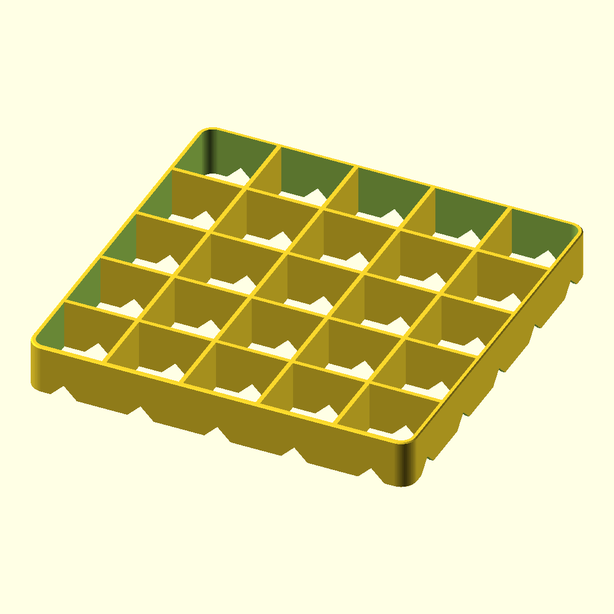
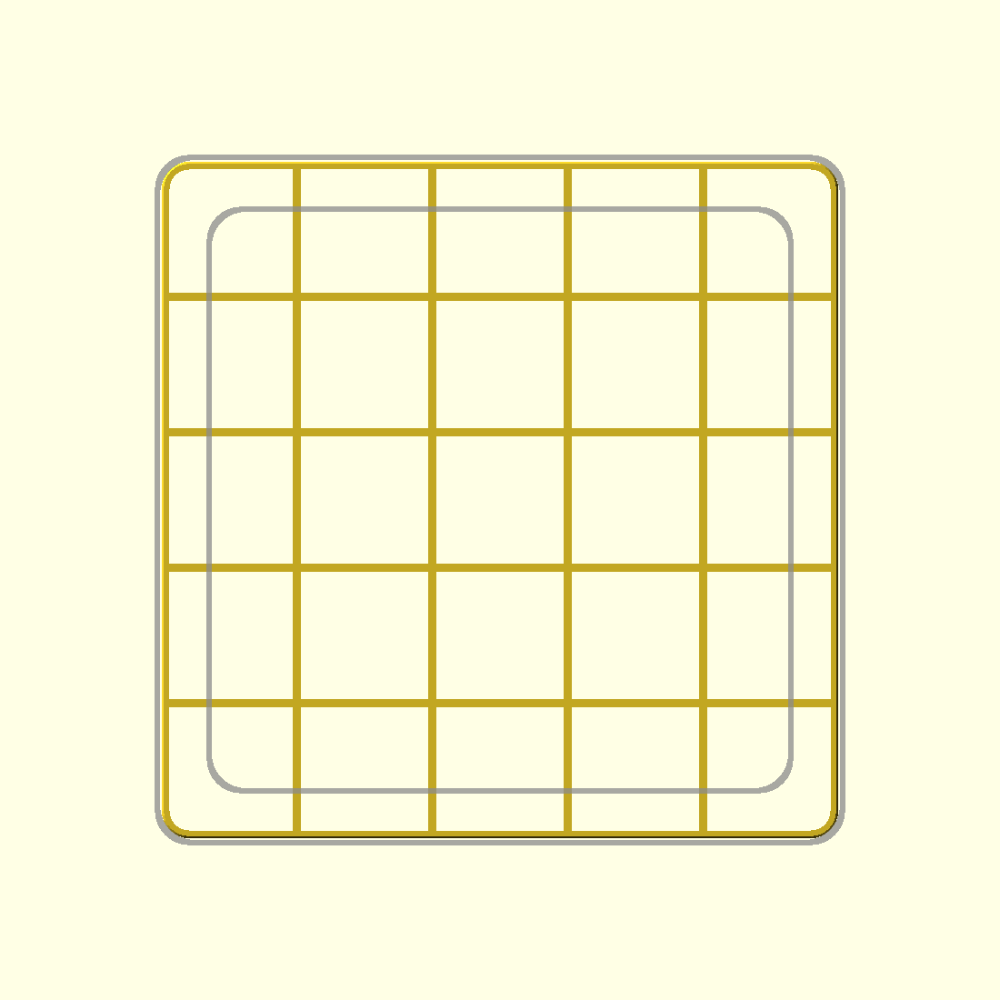
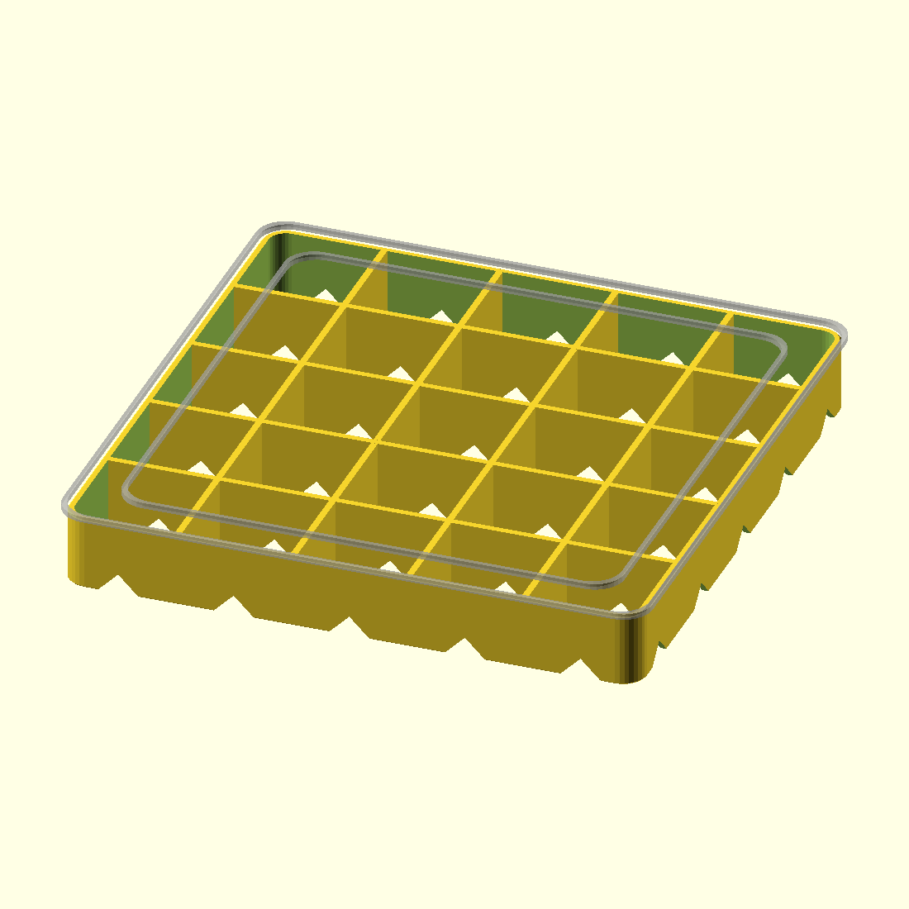
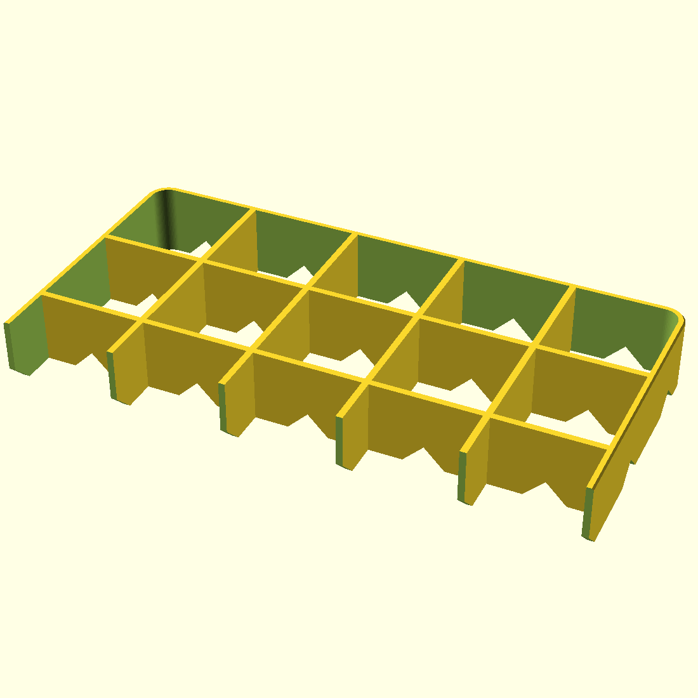
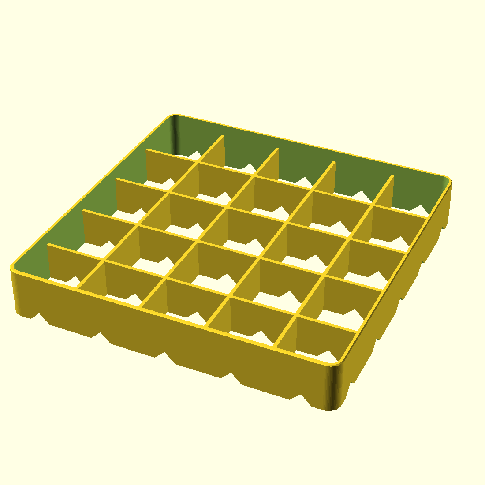

# Outdoor Plant Pot Stand

A square open-lattice riser that a tapered square glazed ceramic pot sits on, out on the
pavers. It lifts the pot **25 mm** clear of the ground so the drain hole in the centre of
the pot's base actually drains — water falls straight through the open lattice, then runs
out sideways at ground level and away, instead of the pot sitting in its own puddle.



**One size suits every pot from a 170 mm to a 200 mm square base** — the whole top is a
single flat plane, so there is no size-specific seat or lip to foul a different pot.

- Footprint **196 × 196 × 25 mm**, one piece, ~153 g of PETG, no supports, no infill.
- 5 × 5 open cells (37 mm clear each), with a whole cell dead centre under the pot's
  drain hole.
- Drain channels notched into the bottom of every rib and through the outer wall on all
  four sides, so water can't be trapped anywhere underneath.
- Sized for a **30 kg** pot (`design_load_kg`), which the build checks rather than assumes.
- Fully parametric — change `pot_base_max` (or `stand_size`) and re-export for other pots.

## How it suits 170–200 mm bases

| | |
|---|---|
|  | The grey outlines are a **170 mm** base (inner) and a **200 mm** base (outer). Every rib top and the outer wall top are coplanar at z = 25, so any base in between lands flat on a set of ribs — nothing to rock on. |



Because the lattice runs edge to edge:

- A **170 mm** pot sits on 4 ribs per axis, and its base edge still lands on the ribs
  running the other way — support goes right out to its rim, not just under its middle.
- A **200 mm** pot covers the whole stand (which then hides underneath it) and is
  supported to within 2 mm of its base edge, including on the outer wall.
- Anything down to about **120 mm** square still works; below that the base stops
  reaching enough ribs.
- A pot **bigger** than 200 mm is fine too — it just overhangs a little more. Nothing
  about the default stand is size-critical, so you don't need to measure precisely
  before printing (only the optional containment lip below cares about exact size).

**If your pot has a raised foot ring** rather than a flat slab base, it still works: the
ribs run edge to edge, so a foot ring at the rim of a 170 mm pot crosses the ribs running
the other way at 16 points around it, all in the same plane. If you'd rather have more
contact points than that, `-D cell_target=28 -D min_cell_open=26` gives a 7 × 7 grid with
26.2 mm cells (still far wider than the pot's drain hole). `cell_target` alone won't do
it — `min_cell_open` caps the grid at 5 × 5 so a finer lattice can't quietly starve the
cell under the drain hole.

Two other things worth knowing: it raises the pot's centre of gravity by 25 mm, so a tall
pot gets marginally easier to tip — keep it snug against the wall as in the photos. And on
wavy pavers the stand is stiff enough that it won't conform; it'll bed down on the high
spots the same way the pot does now.

## Carrying 30 kg

The build computes the load path from the parameters and asserts it, rather than leaving
it as a claim in a comment — the numbers are echoed every time you render:

| | |
|---|---|
| Wall cross-section at the seat | **51 cm²** |
| …at ground level, where the drain channels narrow it | **32 cm²** |
| Bearing stress at 30 kg | **0.09 MPa** |
| `max_bearing_mpa` allowable | 2 MPa — deliberately hot-and-tired, since pavers in summer sun reach PETG's heat-deflection temperature |

So it's ~500× below PETG's cold yield and ~20× below an allowable already derated for a
hot paver. Buckling of a 2.25 mm × 25 mm wall panel is a further order of magnitude away.
Raise `design_load_kg` and the assert will tell you when that stops being true.

The reason every wall is 5 perimeters rather than 4 isn't that global margin — it's that
the pot rests on the rib **tops**, and a glazed ceramic base is rarely dead flat, so the
load can land on a handful of rib crossings instead of every rib. Wider rib tops cut that
local contact stress by 25 % for about 20 g.

One caveat that does change with weight: on **soil or sand** rather than pavers, a lattice
sinks more than a solid slab would (30 kg over 32 cm² of ground contact ≈ 90 kPa). On
brick pavers it's irrelevant.

## Where the water goes



1. Water leaves the pot's centre drain hole and drops through the open centre cell —
   nothing to line up, nothing to clog.
2. At ground level, a 14 mm wide × 7 mm tall channel is notched through **every** rib at
   each cell centre, in both directions, so water can cross from cell to cell.
3. The same channels cut through the outer wall — **5 exits per side, 20 in total** — so
   it drains away on whichever side the pavers fall.

The notches are 45° triangles (pointed, not square), which is why the whole part prints
with no supports and no bridging.

## Printing

| | |
|---|---|
| Material | **PETG**, in a light colour (Tg 75–85 °C so it won't sag on hot pavers; tough rather than brittle; moderate UV life). ASA/ASA-CF is the upgrade if you have an enclosure. Don't use PLA outdoors — it creeps under load and goes chalky. |
| Layer height | 0.2 mm |
| Walls | **5 perimeters** — the part *is* perimeters. Every wall is 2.25 mm, which is exactly 5 at 0.45 mm, so there's no gap fill anywhere |
| Infill | **0 %**, top solid layers **0**, bottom solid layers **0** (it's an open lattice by design; solid layers would just try to skin the cells) |
| Supports | **None** |
| Brim | **Yes, 5–10 mm.** A 196 mm footprint of thin walls in PETG will lift at the corners without one |
| Orientation | As modelled — flat on the plate, the ground face down |
| Elephant foot | Leave the slicer's own compensation **on** — only the outer wall is chamfered in the model (a lattice can't be hulled without filling its cells, and nothing mates with this part) |
| Time / material | ~3 h, ~153 g |

Bambu X1C/P1 note: at 196 mm centred it clears the 18 × 28 mm front-left filament-cutter
exclusion zone — just don't let the slicer shove it into that corner.

`pot-stand-v1.3mf` is a Bambu Studio project with these settings already applied; open it,
check the plate, slice. Otherwise import `pot-stand-v1.stl` and dial the table above.

## Tuning

Edit the parameters at the top of `pot-stand-v1.scad`. The asserts in the file will stop
the build (with a message) if a change breaks the design rules.

| Want | Change |
|------|--------|
| Different pots | `pot_base_min` / `pot_base_max` — `stand_size` follows as `pot_base_max - 4` |
| An exact footprint | set `stand_size` directly (≤ 216 mm for an X1C) |
| Taller / more airflow | `stand_height` (below 20 mm, lower `min_lift` too) |
| Less filament, faster print | raise `cell_target` (bigger cells) or drop `stand_height` |
| Heavier pot | `design_load_kg` — the bearing check fails and names what to change if it no longer stacks up |
| Stiffer / finer grid | lower `cell_target` **and** `min_cell_open` together, or `rib_walls` 5 → 6 |
| Bigger drain channels | `drain_w` |
| More kick-resistant edge | `outer_walls` 5 → 6 |
| A lip that stops the pot sliding off | `rim_extra = 8`, `stand_size = 212`, `cell_target = 42` — see below |

### Optional containment lip



`rim_extra` raises **only the outer wall** above the flat seat, turning the stand into a
shallow tray the pot drops into (212 × 212 × 33 mm shown).

What has to clear the pot is the lip's **inner opening** (`stand_size - 2 × wall_thick`),
not the outer footprint — and because these pots taper, the pot is already a little wider
at the top of the lip than at its base. The assert accounts for both, and tells you the
minimum `stand_size` if you get it wrong:

```
containment lip too tight: inner opening 201.5mm, needs 206.96mm (pot base + taper
over the lip height + clearance). Raise stand_size to at least 211.46mm.
```

So **measure your pot `rim_extra` mm above its base**, not just its base, and set
`pot_taper` (default 0.06 mm of extra width per mm of height, per side) to match. For a
200 mm pot with an 8 mm lip that lands at 212 mm:

```bash
openscad -o pot-stand-corral.stl -D stand_size=212 -D rim_extra=8 -D cell_target=42 \
  pot-stand-v1.scad
```

## Notes from the design review

- **Impact:** the vertical load path has ~500× margin (above), but a sideways knock
  (boot, broom, rake) bends a wall at its base, which is PETG's weaker direction. Hence
  2.25 mm walls throughout rather than 1.8 mm — +56 % section modulus on the outer wall,
  the one member left standing proud beside a smaller pot, and it's a closed loop tied to
  the ribs every 39 mm rather than a free fin. Accepted trade-off of an open lattice;
  `outer_walls = 6` if you want more.
- **Cleaning:** leaves and silt will collect in the open cells over a season. Lift the pot
  and hose it out; the drain channels are 14 mm wide with 20 exits, so it won't block.
- **Worth checking on the first print:** that the 45° notch apexes come out clean (they're
  right at the support-free threshold), and that the stand itself doesn't rock on your
  pavers — it contacts the ground on many small pillar segments rather than a continuous
  slab, so a bad paver could see it teeter where a solid slab wouldn't.

## Files

- `pot-stand-v1.scad` — parametric OpenSCAD model (all dimensions + design contracts)
- `pot-stand-v1.stl` — default 196 × 196 × 25 mm, ready to slice
- `pot-stand-v1.3mf` — Bambu Studio project with the print settings baked in
- `preview-*.png` — renders (iso, top with pot outlines, front, section, lip variant)

## Inspection aids

Both are off by default and never reach the exported solid:

```bash
openscad -D show_pot=true pot-stand-v1.scad   # ghost the 170/200 mm pot footprints
openscad -D section=1     pot-stand-v1.scad   # cut away at Y=0 to see the drain channels
```
